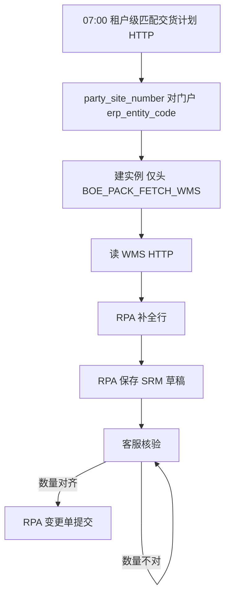

# 京东方发票箱单一期实施计划

对照设计：[AutoTask-BOE v1.0 设计-发票箱单SOP.md](project-docs/prd/boe/AutoTask-BOE%20v1.0%20设计-发票箱单SOP.md)。`process_code = srm_boe_invoice_packing`。不改今晚 v5.5 正式迁库范围。

## 和天地伟业的硬差别

- 匹配作业 **不绑门户、不登录 SRM**，不要复用 [`create_scan_task`](service/app/services/process_instance_service.py) / TIANDI `JobScheduler` 扫单。
- 叶子门户仍按子代码建：`category=BOE`，`erp_entity_code` = 子代码（如 `C000142-01`），`erp_entity_name` = 客户名称，`business_entity` = 交易主体。
- Engine Cookie **已经**按门户 URL + 用户名缓存（[`session_cache_key`](rpa-engine/src/nodeskclaw_rpa_engine/runtime/session_cache.py)），AA/AD 天然共享；一期要避免同一 `login_account` 并行开两个 BOE 浏览器 Run。
- 一期不传附件、AutoTask 不拦邮箱码；Flow 不要为 OTP 走 `WAITING_HUMAN`。

## 数据落点（尽量不扩 Tiandy 行表）

[`process_line_items`](service/app/models/process_line_item.py) 是客户订单列形，不要硬塞箱单行。

- 实例：已有 `process_instances`，幂等 `(portal_account_id, srm_boe_invoice_packing, biz_key=doc_no)`。
- 头、WMS 行、数量提醒、`srmDraftNo`、`reviewBaseline` 全部进 `summary` JSON。
- 地区对照表单独建（Client 维护），**写 Alembic 但不执行**，等你口头授权再迁。

`summary` 头字段只含 SOP §3.5 关键字段；体积单位常量 `立方米`；启用 AI 识别恒为否。客户三字段只读门户，不进 `reviewBaseline`。

## 阶段 A：Task 匹配 + 读 WMS + Client 列表详情

可单独验收：7 点（或手动）拉计划 → 落单 → 拉 WMS → 列表/详情看见头行和数量提醒。无浏览器。

**Task**

- 阶段码补进 [`ProcessStage`](service/app/models/enums.py) 与 `STAGE_DEFINITIONS`：`BOE_PACK_SCAN_PLAN` … `BOE_PACK_SUBMITTED` / `BOE_PACK_CANCELLED`。
- 新服务例如 `service/app/services/boe_packing_service.py`，不要把分支堆进客户订单的 `on_sub_task_finished`。
- HTTP 客户端仿 [`sdms_client.py`](service/app/services/sdms_client.py) + `integration_call_logs`（`system=SMC` 或独立码）：
  - 交货计划：`POST {SMC_API_BASE_URL}/aiats/ebs_sjh_header_boe`，无 body、无鉴权。
  - WMS：`{SMC_API_BASE_URL}/test_demo/boe`，参数 `doc_no`（路径进 `.env`，不进 Flow）。
- 匹配：对每条返回用 `party_site_number` 找 `category=BOE` 且未删的门户；没有门户则记失败、不建单；`org_code != 101` 只提醒。
- 建单后停在「读 WMS 装箱单」，**立刻**对该实例跑 WMS 任务（HTTP 任务，不是 RPA）；失败只重试本任务。
- 租户定时器仿 [`SCAN_JOB_*`](service/app/core/config.py)：`BOE_PACK_MATCH_JOB_ENABLED` + 7:00 中国时区；lifespan 里独立 scheduler，**不是** 9 条门户 Binding cron。
- 列表 API：按 `process_code` + `category=BOE` 过滤，不要复用现有 `/processes` 的 TIANDI/`srm_customer_order` 硬过滤。
- 详情 PATCH：核验阶段可改发票号/工厂/日期/体积/行数量等；门户三字段只读。
- 数量：`sum(delivery_qty) != deliver_qty` 写入 `summary` 提醒，**不失败、不拦保存**。
- 作废/重试：对齐天地伟业旁路；匹配未建单才允许重扫。

**Client**

- [`PROCESS_MENU_BY_CATEGORY.BOE`](app/src/features/srm-portals/portal-category.ts) 增加「发票箱单」，新路由（例如 `/process-instances/invoice-packing`），**不要占用** `/processes`。
- 新 feature：进度条用 SOP 显示名；头表 §3.5；行表 PO/料号/开票数/净重/地区；数量不对横幅。
- 管理中心门户：建京东方门户时说明客户代码填子代码。

**验收：** 测库配 1～2 个 BOE 门户（子代码对得上样例 `C000142-01`），手动触发匹配，能出单、能重试 WMS。不迁新表也可做完本阶段。

## 阶段 B：地区表 + 三次 RPA + 核验提交

依赖阶段 A。地区表迁库须你授权。

**地区**

- 表：`region_code` → `srm_display_name`（可带 `category=BOE`）。Client 简单维护页。缺映射行标红，核验手选，不拦读 WMS。

**模板与 Binding**

- 三个 `WorkflowTemplate`：`srm_boe_pack_enrich` / `srm_boe_pack_save_draft` / `srm_boe_pack_submit`。
- 每个 BOE 门户各绑三条 ENABLED Binding（对账单同款：[`_find_binding`](service/app/services/process_instance_service.py) + `_create_sub_task`）。
- 同一 `login_account` 的 BOE RPA 串行排队。

**Flow**（`rpa-flows/rpa_flow_srm_boe_pack_*`，布局抄对账单包；选择器从 [影刀-京东方-selectorsV2.xml](project-docs/prd/boe/影刀-京东方-selectorsV2.xml) 抽）

- 导航：登录 → dashboard（不存 ticket）→ **点击**送货管理 → 发票箱单。禁止 `goto` 单据 URL。
- 补全：按 `po_num`+`item_num` 搜采购凭证；0 行/多行停本节点；回写行项目、剩余开票数、物料描述等；本 Run 可不点 SRM 保存。
- 保存草稿：按 Client 当前单据重建；一期不传附件；失败回写页到 `summary`；成功写流水号 + `reviewBaseline`，进入核验。
- 提交：列表用流水号打开草稿，只打 `diff(reviewBaseline, 当前)`；Client 在发 Run 前若数量未对齐则 **硬拦、不建任务**。
- 登录：用户+密码；不处理邮箱码。Cookie 沿用现缓存。

**Client 核验页：** 基线 vs 当前 diff；提交按钮受数量闸门。

**验收：** 一条测单走通到 SRM 草稿保存 + 提交（附件空、验证码靠当天已在 SRM 人工登录过）。

## 阶段 C：打开 7:00 与文档

- 测环境打开 `BOE_PACK_MATCH_JOB_ENABLED`。
- 更新 lat.md（[`BoeInvoicePacking`](lat.md/domain.md)）、SOP 实施状态、[`PROJECT_CONTROL.md`](project-docs/PROJECT_CONTROL.md)。
- `lat check`。

## 明确不做（本期）

- 附件 / WMS 文件地址 / 双签 PO / 读邮件验证码
- 按每个 BOE 门户循环 SRM 扫单
- 把 SRM 样例头表全量搬进 Client
- 未授权执行地区表 DDL
- 并进今晚 v5.5 正式库 `upgrade head`

## 风险

- 门户客户代码必须等于接口 `party_site_number`，否则匹配建不出单。
- 同一账号并行 Run 会抢浏览器态，必须串行。
- 保存草稿失败时 SRM 可能已有半成品：Flow 先按发票号/流水号搜列表，有则改、无则新建（SOP §8）。
