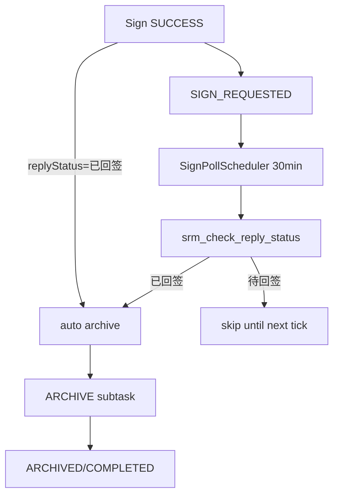

# v2.02 流程实例：回签轮询 + 详情优化

依据：[project-docs/prd/v2.02客户订单-业务需求.md](project-docs/prd/v2.02客户订单-业务需求.md)，基线为 v2.01 已落地实现。交付顺序按 PRD §8：**O2 → O1 → R2**。本版不做 TEMP 回填清理、不合并交期/签章节点。

## 已定实现决策

- **回签探测**：新建只读 Flow `rpa_flow_srm_check_reply_status/1.0.0`（template `srm_check_reply_status`），复用签章 Flow 的 `reply_status` 选择器/适配逻辑；**禁止**复用签章 Flow 做轮询（会误点签章）。
- **自动归档**：抽取 `archive_signed_order` 的核心为内部函数（可带 `actor`），人工 API 与轮询/`_handle_sign_finished` 短路共用；创建前检查是否已有进行中/成功的归档子任务（幂等）。
- **headerId**：在现行建单 Flow 顶层输出补 `headerId`（从 ERP 结果行取），service `summary` 落库；Client 用 `AutoTaskEndpointConfig.sdmsWebBaseUrl`（默认 `http://192.168.99.35:8080/`）拼链，经现有 `ExternalLink` 打开系统浏览器。
- **子任务树**：API 给 `ProcessSubTask` 补可选 `lineNumber`（从 task input 解析）；Client 按节点类型聚合，填交期再按行；历史失败默认 `Collapsible` 折叠。无新表/无迁移。

---

## Workstream A — O2：headerId + SDMS 超链接

### Flows
- 在 [rpa-flows/rpa_flow_supplier_portal_prepare_erp_order/1.2.5/flow.py](rpa-flows/rpa_flow_supplier_portal_prepare_erp_order/1.2.5/flow.py) 派生 **1.2.6**：成功返回增加 `headerId`（从 `erp_result["rows"]` 首条有效行读取，与现有 `ERP_RESULT_ROW_FIELDS` 一致）。
- 发布包 + 切换 Portal Binding（运维步骤，实施时执行）。

### Service
- [_handle_create_sdms_finished](service/app/services/process_instance_service.py) 的 `summary` 增加 `headerId`（与 `orderNumber`/`poNo`/`supplier*` 并列）。

### Client
- `AutoTaskEndpointConfig` 增加 `sdmsWebBaseUrl`：贯通 [types/endpoint-config.ts](app/src/types/endpoint-config.ts)、zod schema、`auth-endpoint-config-store`、`EndpointConfigPanel`；默认测试基址如上。
- 工具函数：`buildSdmsOmViewUrl(base, headerId)` → `{base}/sdms/om/sdms_om_main/sdmsOmMain.do?method=view&fdId={headerId}`（注意 base 去尾斜杠）。
- [process-detail.tsx](app/src/features/processes/process-detail.tsx) / [process-dates.tsx](app/src/features/processes/process-dates.tsx)：有 `summary.headerId` 时「ERP 订单」用 `ExternalLink`；否则纯文本。

### 测试
- Flow 单测：成功输出含 `headerId`。
- Client：`process-instances.test.tsx` 覆盖有/无 `headerId` 两种渲染。

---

## Workstream B — O1：子任务树状展示

### Service（轻量）
- [ProcessSubTaskResponse](service/app/schemas/process.py) 增加可选 `lineNumber`。
- 详情组装时从 `AutomationTask.input` JSON 解析 `line_number`（填交期任务）；其它类型为空。

### Client
- 更新 [process-instance.ts](app/src/types/process-instance.ts) 类型。
- 在 `process-detail.tsx` 用现有 `Collapsible`，按固定节点顺序聚合：
  1. `srm_prepare_erp_order`（建 SDMS）
  2. `srm_fill_line_delivery_date`（再按 `lineNumber`）
  3. `srm_sign_order`
  4. `srm_upload_order_attachment`
  - 可选显示探测任务 `srm_check_reply_status`（若有）归在签章节点下或独立「回签探测」。
- 每组默认展示**最新**一条（按 `createdAt`）；更早失败/历史折叠。叶子仍链到 `/tasks/$taskId`。

### 测试
- 详情 fixture 含同节点多次重试 + 多行填交期，断言树结构与折叠。

---

## Workstream C — R2：回签轮询 + 自动归档

### 新 Flow
- 包：`rpa-flows/rpa_flow_srm_check_reply_status/1.0.0/`（`flow.py` / `selectors.json` / `manifest` / 单测）。
- 行为：login → open detail → 读 `reply_status` → 输出 `{ schemaVersion, poNo, replyStatus }`；**不点击签章**。
- 发布 + 新建 WorkflowTemplate/Binding：`srm_check_reply_status`。

### Service 核心
1. **幂等归档内部 API**（从现 `archive_signed_order` 抽出）  
   - 门禁：`ACTIVE` + `SIGN_REQUESTED|SIGNED`。  
   - 若已有同实例归档子任务处于 `QUEUED|RUNNING|WAITING_HUMAN` 或已 `SUCCESS` → 跳过创建。  
   - `SIGN_REQUESTED` → `SIGNED`（note 区分 `sign-poll-scheduler` / `system-auto` / 人工）。  
   - 再 `_create_sub_task(ARCHIVE, …)`。

2. **`_handle_sign_finished`**  
   - 成功仍进 `SIGN_REQUESTED`。  
   - 若 `run.output.replyStatus == "已回签"` → **立即**调用幂等归档（演示门户常见短路，不必等 30 分钟）。  
   - `WAITING_HUMAN` / 未确认 → 不归档（保持现状）。

3. **探测 finish 钩子**  
   - `task_type == srm_check_reply_status` 且成功且 `replyStatus==已回签` → 幂等归档。  
   - 仍为「待回签」→ 无阶段变更。  
   - 探测失败 → 记实例/日志错误，不 fail 整单（与签章失败策略一致）。

4. **`SignPollScheduler`**（仿 [scan_scheduler.py](service/app/services/scan_scheduler.py)，间隔语义不同）  
   - 配置：`SIGN_POLL_JOB_ENABLED`（默认 False）、`SIGN_POLL_INTERVAL_SECONDS`（默认 **1800**）。  
   - lifespan 挂载同 [main.py](service/app/main.py) 扫单模式。  
   - 每轮：查 `ACTIVE + SIGN_REQUESTED`；对每单若无进行中探测任务则 `_create_sub_task(CHECK_REPLY, {po_no})`。  
   - 人工「已签章订单下载」保留为兜底，调用同一幂等归档。

### Client 文案
- `SIGN_REQUESTED` 提示改为「系统轮询回签中」类文案；按钮文案改为兜底语义（如「手动触发已签章下载」），不再暗示主路径靠人工。

### 测试
- service：幂等（连续两次归档不双建子任务）；签章 output 已回签短路；探测成功触发归档；调度器 `process_once` 只覆盖 `SIGN_REQUESTED`。
- Flow：只读探测单测。

---

## 联调与文档

- 更新 [PROJECT_CONTROL.md](project-docs/PROJECT_CONTROL.md) 当日日志：O2/O1/R2 完成项；明确 **R1 演示门户不落库** 时轮询可能扫不到真实「已回签」，R2 验收优先可落库环境或受控 TEMP。
- 不修改 `.cursor/plans/v2.0_…` 旧计划文件；不执行 DB DDL（本版无新表）。

## 验收对照（PRD §7）

| ID | 验收 |
|----|------|
| R2 | `SIGN_REQUESTED` 在 SRM 已回签后 ≤1 个轮询周期自动归档；无重复归档子任务；签章瞬间已回签可立即归档 |
| O1 | 详情子任务按节点/行树状；失败历史不刷屏 |
| O2 | summary 有 `headerId` 时可点开 SDMS；改 base 只改主机 |
| R1 | 控制文档写明演示限制 |
