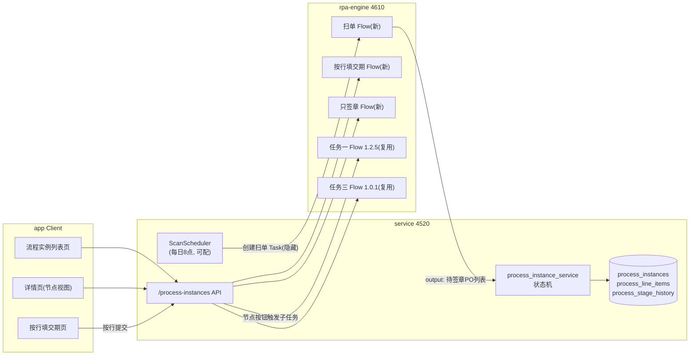

# v2.0 流程实例（SOP 主任务）全链路实施计划

需求来源：[project-docs/prd/v2.0客户订单-业务需求.md](project-docs/prd/v2.0客户订单-业务需求.md)（节点、阶段状态、已确认事项以此为准）。

## 总体架构

关键决策（已与用户确认）：全链路一次实施；新旧链并存（successor 机制不动）；扫单调度在 Task 服务内建（仿 `SuccessorJobProcessor`）。

## Workstream 1：service 数据模型与迁移

- 新增模型（[service/app/models/](service/app/models/)）：
  - `process_instance.py`：id、tenant_id、process_code（如 `srm_customer_order`）、biz_key（po_no）、portal_account_id、stage（8 个阶段标识）、status、line_total/line_done、timestamps；唯一约束 `(portal_account_id, process_code, biz_key)` 即 PRD 幂等记录表职责
  - `process_line_item.py`：instance_id、line_number、material_number、expected_delivery_date、line_status（未填写/填写中/已写入/写入失败）、sub_task_id
  - `process_stage_history.py`：instance_id、from_stage、to_stage、actor、created_at
  - `automation_task.py` 增加 `process_instance_id` 可空列（子任务关联，旧任务为 null）
- Alembic 迁移：`service/alembic/versions/` 新 revision，down_revision=`7c1f4d8e2a90`，中文命名沿用现有风格
- 注意：AGENTS.md 数据库暂停点——只准备迁移文件，执行 `alembic upgrade head`（含 service 启动自动迁移）前需用户明确授权

## Workstream 2：service 业务层与 API

- `app/services/process_instance_service.py`：
  - 状态机：`CREATING_SDMS → SDMS_CREATED → DATES_PARTIAL → DATES_COMPLETE → SIGN_REQUESTED → SIGNED → ARCHIVED`，任意节点失败 → `FAILED`（整单失败，不回滚，可重试/取消）
  - `create_from_scan(po_list)`：按唯一约束幂等创建，自动触发节点1子任务（复用任务一 Binding）
  - `submit_line_date(instance_id, line_number, date)`：校验阶段 → 创建按行子任务（automation_task + QUEUED Run）
  - `request_sign()` / `confirm_signed_and_archive()`：节点3/4 按钮触发对应子任务
  - `on_sub_task_finished(task_id, run)`：挂入 [dispatch_service.py](service/app/services/dispatch_service.py) `finish_run()` 成功分支（与 `enqueue_successor_job` 并列），按子任务类型推进阶段/行状态；节点1失败即整单 FAILED
- `app/schemas/process.py`：列表项、详情（含行、阶段历史、子任务）、操作请求体
- `app/api/process_instances.py` + 注册到 [router.py](service/app/api/router.py)：
  - `GET /process-instances`（按 stage/status 过滤）
  - `GET /process-instances/{id}`（详情聚合）
  - `POST /process-instances/{id}/lines/{line_number}/date`（按行提交）
  - `POST /process-instances/{id}/sign`、`POST /process-instances/{id}/archive`、`POST /process-instances/{id}/retry`、`POST /{id}/cancel`
- 流程模板第一期硬编码为 `srm_customer_order` 常量（阶段/按钮定义），不做模板管理 UI

## Workstream 3：扫单调度（Task 服务内建）

- `app/services/scan_scheduler.py`：仿 `SuccessorJobProcessor`（[task_successor_service.py](service/app/services/task_successor_service.py) L425-497），lifespan 启动于 [main.py](service/app/main.py)
- 配置（[config.py](service/app/core/config.py)）：`SCAN_JOB_ENABLED`、`SCAN_JOB_CRON_HOUR=8`、`SCAN_JOB_POLL_INTERVAL_SECONDS`
- 机制：到点创建「扫单 automation_task」（专用 task_type `srm_scan_pending_orders`，列表页默认过滤不显示）→ Run 成功 → `finish_run` 钩子读 output 的 PO 列表 → `create_from_scan`
- 手动触发 API：`POST /process-instances/scan`（便于测试，不必等早上8点）

## Workstream 4：rpa-flows 三个 Flow

- 新建 `rpa_flow_srm_scan_pending_orders/1.0.0/`：登录 + `/#/supplier/orders` 列表页 `page.evaluate` 采集全部待签章行（参考任务二 1.2.0 的 `collect_order_lines` evaluate 模式），output `{schemaVersion, portalUrl, orders:[{poNo, ...}]}`；需先对真实门户 `http://192.168.102.247:3000` 只读确认列表页选择器/分页
- 新建 `rpa_flow_srm_fill_line_delivery_date/1.0.0/`：基于任务二 1.2.0 fork，input `{po_no, line_number, expected_delivery_date}`，只 `fill_and_verify` 单行 + 点击整单保存（1.1.0 的 `save_all` 选择器）；**前置验证**：真实门户待签章详情页是否有保存按钮、未签章时保存是否持久化（只读探测，不写）
- 新建 `rpa_flow_srm_sign_order/1.0.0/`：基于任务二 1.2.0 fork `run()`，去掉填日期段，只复核全行交期已填 + `sign_and_verify`
- 复用：任务一 `1.2.5`（节点1）、任务三 `1.0.1`（节点4，改为按钮触发，不走 successor）
- 每个 Flow：manifest/selectors/README/单测，ZIP 上传 Engine Registry 校验发布，新建对应 WorkflowTemplate + Binding（精确版本快照）

## Workstream 5：app Client 页面

- 路由（`src/routes/` 薄封装，routeTree.gen.ts 自动生成）：
  - `/processes/`、`/processes/$instanceId`、`/processes/$instanceId/dates`
- 功能页（`src/features/processes/`）：
  - 列表页：业务键/当前阶段/进度(X/N)/状态/阶段按钮，复用 `DataTable` + `FilterBar` 模式
  - 详情页：任务信息卡 + 四节点进度条 + 子任务/执行记录（点击跳现有 `/runs/$runId` 追查日志证据）+ input/output 折叠
  - 填交期页：抽取复用 [delivery-date-task-editor.tsx](app/src/features/tasks/delivery-date-task-editor.tsx) 的 `DeliveryDateTable`/`OrderSummary`，改为按行「保存」调新 API
- API 层：`services/remote-api.ts` 增加 process-instances 方法，`services/query-keys.ts` 加 key，`services/autotask-api.ts` 挂 facade
- 侧边栏：[sidebar-data.ts](app/src/components/layout/data/sidebar-data.ts) 加「流程实例」入口 + routeTitles
- 扫单任务在现有 `/tasks` 列表按 task_type 过滤隐藏

## 验证

- service：新增 pytest（状态机流转、幂等创建、行提交门禁、finish_run 钩子），既有 66 项不回归
- flows：各自 pytest；Engine 包校验 PASSED
- app：Vitest（列表渲染、阶段按钮可见性、按行提交），`tsc --noEmit`，生产打包
- 端到端（需用户授权 + 真实门户）：手动触发扫单 → 建单 → 按行填交期 → 签章 → 归档全链

## 风险与前置确认

- 门户保存按钮/持久化契约未验证（Workstream 4 前置只读探测，若门户不支持「保存不签章」，节点2设计需回退为整单一次填齐）
- 数据库迁移执行需用户明确授权（AGENTS.md 暂停点）
- 演示门户签章持久化历史问题（PROJECT_CONTROL 未决#14）可能影响节点3 联调