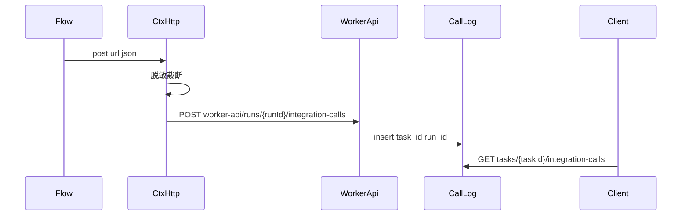

# v5.4 接口调用日志

依据：[project-docs/prd/AutoTask v5.4 接口调用日志.md](project-docs/prd/AutoTask%20v5.4%20接口调用日志.md)。任务信息和报错不动；不进证据中心；不录门户浏览器流量。

**迁库：Alembic `b8c9d0e12f51` 已于 2026-08-27 经用户授权执行（当前 head）。** 不要提交 Git，除非你明确要求。

## 数据流

Task 自己打的 SDMS 不经 Worker：业务客户端直接调同一套 `record_call(task_id=...)`。

Engine 回调 outbox 的 `callback_type` 有 CHECK（只允许 EVENT/ARTIFACT/FINISH）。本期 **不扩 Engine 表**，Worker 在每次 HTTP 结束后 **直接 POST** worker-api（失败只打 Engine 日志，不挡业务）。与 Artifact 元数据回调同一档可靠性。

## 已知限制（写进实现注释即可）

[`generate_statement`](service/app/services/statement_service.py) 在 **创建任务之前** 调 `fetch_check_amount`。查询失败时还没有 `task_id`，无法落表；Client 报错照旧。查询成功后，在生成任务 insert 成功再补写那一行（挂生成任务）。

## 文件边界

- Task 落库与读写：[`service/app/models/`](service/app/models/)、新 service、worker 回调、任务 GET
- 脱敏/截断：Task 写入前必须做；Engine 发送前也做（现成 [`redact_sensitive`](rpa-engine/src/nodeskclaw_rpa_engine/core/logging.py)）
- Engine：[`RunContext`](rpa-engine/src/nodeskclaw_rpa_engine/runtime/context.py) 增加 `http`；[`RpaRuntime.handle`](rpa-engine/src/nodeskclaw_rpa_engine/runtime/engine.py) 注入；[`TaskWorkerApiClient`](rpa-engine/src/nodeskclaw_rpa_engine/workers/task_client.py) 新方法
- Flow 升小版本（只换 HTTP 出口）：建单 `1.2.16` → `1.2.17`；传合同 `1.3.2` → `1.3.3`
- Client：任务详情右栏「接口调用」；远程走现有 IPC `requestAutotaskApi`，不必改 Main 协议

---

## 1. Task：表、脱敏、写入、GET

**模型** [`service/app/models/integration_call_log.py`](service/app/models/integration_call_log.py)（新），`BaseModel` 已有 `id` / 时间戳 / `deleted_at`。字段与 PRD 一致：`tenant_id`、`task_id`、可空 `run_id`、`system`、`method`、`url`、`request_body`、`response_body`、可空 `status_code`、可空 `error_code`、可空 `duration_ms`、`request_truncated` / `response_truncated`（默认 false）。

索引：`ix_integration_call_logs_task_created (task_id, created_at)`、`ix_integration_call_logs_run_id (run_id)`。

登记 [`service/app/models/__init__.py`](service/app/models/__init__.py)。

**迁移** `service/alembic/versions/`，`down_revision = "a7e4b2c81d09"`（当前 head）。文件头注明 dormant，对齐 [`g3b8e2a91c40_scheduler_jobs.py`](service/alembic/versions/g3b8e2a91c40_scheduler_jobs.py)。

**脱敏+截断** 新模块例如 [`service/app/services/integration_redact.py`](service/app/services/integration_redact.py)：

- Header / JSON 键 / query：`password|secret|token|access_token|client_secret|authorization|cookie`
- 值替换 `[REDACTED]`
- URL path 含 `oauth/token`：响应里的 token 字段必抹（即使用户键名漏网）
- 入参、出参各 1MB，超出截断并置标记

**Service** [`service/app/services/integration_call_log_service.py`](service/app/services/integration_call_log_service.py)：

- `record_call(...)`：先脱敏截断再 insert；从 `run_id` 反查 `RpaRun` 得到 `task_id`/`tenant_id`（Worker 路径）；Task 侧调用方直接传 `task_id`+`tenant_id`
- `list_by_task(..., run_id=None)`：未删除、按 `created_at` 升序

**Worker 写** 对齐事件：

- Schema：[`service/app/schemas/dispatch.py`](service/app/schemas/dispatch.py) 增加 `IntegrationCallCreate`
- [`dispatch_service.append_integration_call(db, run_id, body)`](service/app/services/dispatch_service.py)：load run → task，再 `record_call`
- [`rpa_dispatch.py`](service/app/api/rpa_dispatch.py)：`POST /runs/{run_id}/integration-calls`（完整路径 `/api/v1/autotask/worker-api/runs/{run_id}/integration-calls`），无 JWT，与 `create_run_event` 相同

**Client 读** 对齐证据：

- Schema 响应放 [`service/app/schemas/resource.py`](service/app/schemas/resource.py)（CamelModel）
- [`tasks.py`](service/app/api/tasks.py)：`GET /{task_id}/integration-calls?runId=`，`get_current_user` + `_require_task_visible`

**单测** 新文件 `service/tests/test_integration_call_logs.py`：脱敏（含 oauth token、Authorization）；1MB 截断；Worker POST 能挂上 task；GET 无门户权限 403；`runId` 过滤。

本地可跑：`uv run pytest tests/test_integration_call_logs.py`（SQLite/现有测试夹具）。**不要 upgrade 真实 PG。**

---

## 2. Task 侧两个 SDMS 出口

统一小包装：`record_httpx_exchange(db, *, task_id, tenant_id, run_id, system, request, response_or_exc)`，供两个客户端用。

- [`sdms_client.fetch_check_amount`](service/app/services/sdms_client.py)：增加可选 `on_exchange` 回调，或返回交换摘要。[`generate_statement`](service/app/services/statement_service.py) 在生成任务 `commit` 成功后 `record_call(system="SDMS")`。失败且无任务：不写表。
- [`sdms_attachment_client.upload_statement_invoices_to_sdms`](service/app/services/sdms_attachment_client.py)：增加 `task_id`/`run_id`/`tenant_id`/`db`；[`on_submit_finished`](service/app/services/statement_service.py) 已有 `task`/`run`，传入。每个文件 POST 一行。

扩展现有 [`test_statement_service.py`](service/tests/test_statement_service.py) / [`test_sdms_attachment_client.py`](service/tests/test_sdms_attachment_client.py)：成功生成后库里有 SDMS 查询行；提交挂发票会写行。

---

## 3. Engine `ctx.http`

新类型例如 `IntegrationHttp`（`get`/`post`/`request`，内部 `httpx.AsyncClient(trust_env=False, follow_redirects=False)`，与现 Flow 客户端一致）。

每次请求（含超时、连接失败）：

1. 计时、读 body（`json`/`data`/`content`/`params`/`files` 记成文本；multipart 只记文件名列表不记字节）
2. `redact_sensitive` + Task 同规则抹 query
3. `TaskWorkerApiClient.integration_call(run_id, ...)`；失败 `logger.warning`，不改变返回给 Flow 的 response/异常
4. 把 httpx 的 response 或原异常抛回 Flow

`RunContext` 增加字段 `http`。[`RunContext.create`](rpa-engine/src/nodeskclaw_rpa_engine/runtime/context.py) 与 [`RpaRuntime.handle`](rpa-engine/src/nodeskclaw_rpa_engine/runtime/engine.py)（约 163 行，现已有 `lease.task_id`/`run_id`）注入。Flow 测试里的假 ctx 补一个 stub `http`。

[`workers/schemas.py`](rpa-engine/src/nodeskclaw_rpa_engine/workers/schemas.py) + [`task_client.py`](rpa-engine/src/nodeskclaw_rpa_engine/workers/task_client.py)：`POST worker-api/runs/{run_id}/integration-calls`。

Engine 单测：假 httpx 传输断言会 POST worker-api；body 无 `access_token` 明文；超时仍会 POST 且 `status_code` 为空。改 [`rpa-engine/tests/test_runtime_engine.py`](rpa-engine/tests/test_runtime_engine.py) 里构造 `RunContext` 的夹具。

---

## 4. Flow 升版（只换出口）

复制包，业务逻辑不改：

- [`rpa-flows/rpa_flow_supplier_portal_prepare_erp_order/1.2.16`](rpa-flows/rpa_flow_supplier_portal_prepare_erp_order/1.2.16) → `1.2.17`：`ErpSalesOrderClient` 不再自建 `httpx.AsyncClient`，用 `ctx.http`（`system="ERP"`）。token + import 自然变成两行。
- [`rpa-flows/rpa_flow_supplier_portal_upload_order_attachment/1.3.2`](rpa-flows/rpa_flow_supplier_portal_upload_order_attachment/1.3.2) → `1.3.3`：`AttachmentSystemClient` 同样改 `ctx.http`，`system="SDMS"`。

单测从旧版拷过来，stub `ctx.http` 记录调用次数。跑：

- `uv run pytest rpa-flows/rpa_flow_supplier_portal_prepare_erp_order/1.2.17/tests`
- `uv run pytest rpa-flows/rpa_flow_supplier_portal_upload_order_attachment/1.3.3/tests`

发布与切 Binding **等你点头后再做**（演示建单仍 1.2.11；正式演练再切 1.2.17 / 1.3.3）。未迁库前，Worker POST 会 404，Flow 业务仍应成功（回调失败只 warning）。

---

## 5. Client 任务详情

远程 IPC 已是通用 HTTP，只加渲染层：

- 类型 + `queryKeys.tasks.integrationCalls(taskId)`
- [`remote-api.ts`](app/src/services/remote-api.ts) `GET /tasks/{taskId}/integration-calls`
- [`autotask-api.ts`](app/src/services/autotask-api.ts) / mock 返回 `[]`
- 组件（建议 [`app/src/components/business/integration-call-panel.tsx`](app/src/components/business/integration-call-panel.tsx)）：列表时间、system、method、url、status、errorCode；点开看入参/出参（等宽、可滚动）
- 挂在 [`task-detail.tsx`](app/src/features/tasks/task-detail.tsx) 右栏「关联证据」上方或下方，标题 **接口调用**

无浏览器可跑时：mock 模式打开任务详情应出现空状态，不报错。

---

## 6. 总控与验收对照

更新 [`PROJECT_CONTROL.md`](project-docs/PROJECT_CONTROL.md) 当日日志：代码已改、迁移未执行。PRD 状态改为「代码已改，迁库待授权」。

对照 PRD 验收：

1. 建单 ERP 拒绝：报错码不变；详情能看到导入 URL、脱敏请求、响应正文
2. token + 导入两行；无 access token 明文
3. 生成任务创建成功后能看到 SDMS 查询行；生成前查询失败仍无任务行
4. 证据中心无这份 JSON
5. 第一期五个出口不再直连未包装的 `httpx`（Flow 走 `ctx.http`，Task 走 record 包装）

**你授权后** 再执行 Task：`alembic upgrade head`。Engine 不必迁库。然后重启唯一 Task 4520；有正式 Binding 时再发 1.2.17 / 1.3.3。
