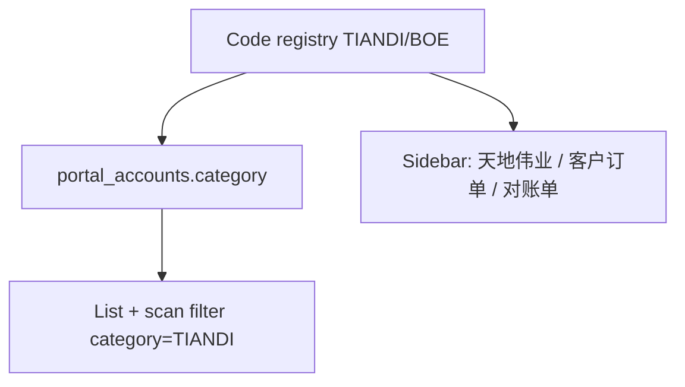

# v5.5 门户分类与流程实例菜单

依据 [AutoTask v5.5 门户和流程实例优化.md](project-docs/prd/tiandy/AutoTask%20v5.5%20门户和流程实例优化.md)。分类码写死；一期只交付天地伟业菜单与过滤；京东方仅出现在门户下拉。

**硬约束**

- 不改 `process_instances` 唯一键、`srm_customer_order` / `srm_tiandi_statement`、路由 `/processes` 与 `/process-instances/statements`
- 准备 Alembic，**未授权不执行**（含演示/正式库）
- 发布顺序必须是：迁库回填全部 `TIANDI` → 再发按分类过滤的 Task → 再发 Client。未回填就过滤会让列表变空
- 旧 Client 创建门户不传 `category` 时，API 缺省 `TIANDI`

## 1. 分类注册表（Task + Client 各一份常量）

Task 新增例如 `service/app/domain/portal_category.py`（或放进现有 [enums.py](service/app/models/enums.py)）：

- `TIANDI` / `BOE` 与显示名
- `TIANDI` 绑定的流程：`srm_customer_order` → `/processes`，`srm_tiandi_statement` → `/process-instances/statements`
- `BOE` 一期不注册菜单项
- 扫单模板 `srm_scan_pending_orders` 只允许 `TIANDI`

Client 镜像 [app/src/features/srm-portals/portal-category.ts](app/src/features/srm-portals/portal-category.ts)，侧栏与表单都读这份表，避免散落 `if 京东方`。不新增目录 API。

## 2. 迁库（只写文件）

当前 head 是 `c1d8e4f90a62`（[c1d8e4f90a62_portal_owner_created_by_names.py](service/alembic/versions/c1d8e4f90a62_portal_owner_created_by_names.py)）。

新 revision：`portal_accounts.category` `String(32)`

- `upgrade`：加列（可暂 `server_default='TIANDI'`）→ `UPDATE` 全表为 `TIANDI` → `NOT NULL`
- `downgrade`：删列
- 种子 [service/app/startup/seed.py](service/app/startup/seed.py) / `srm-portals.json` 补 `category: TIANDI`，避免本地 seed 漏列

## 3. Task 读写与缺省

改 [portal_account.py](service/app/models/portal_account.py)、[portal_account.py schema](service/app/schemas/portal_account.py)、[portal_account_service.py](service/app/services/portal_account_service.py)：

- Create：缺省 `TIANDI`；非法 code 400
- Update：可改分类；不传则不动
- Response：`category`

测试扩 [service/tests/test_portal_accounts.py](service/tests/test_portal_accounts.py)：缺省、非法值、回读。

## 4. 列表与扫单按分类过滤

回填后集合应等于现在，但代码必须按分类过滤，避免以后建 BOE 门户串进天地伟业。

- [list_instances](service/app/services/process_instance_service.py)：join 门户，`category=TIANDI`（客户订单列表已按 `process_code` 过滤）
- [list_bills](service/app/services/statement_service.py)：同样 join `StatementBill.portal_account_id`
- [create_scan_task](service/app/services/process_instance_service.py)：非 `TIANDI` 直接拒绝。这是定时扫单（[scheduler_job_service.py](service/app/services/scheduler_job_service.py) `fire_scheduler_job`）和旧 [scan_scheduler.py](service/app/services/scan_scheduler.py) 的统一闸门
- [ScanScheduler.process_once](service/app/services/scan_scheduler.py) where 再加 `category=TIANDI`（双保险）

测试：非 TIANDI 门户的订单/对账单不出现；扫单创建失败信息明确。

## 5. Client：门户与菜单

- [portal-account.ts](app/src/types/portal-account.ts) 加 `category`
- [portal-account-form-dialog.tsx](app/src/features/srm-portals/components/portal-account-form-dialog.tsx) 必选下拉（天地伟业 / 京东方）；编辑带回现有值
- 门户列表/详情展示分类
- [sidebar-data.ts](app/src/components/layout/data/sidebar-data.ts)：`流程实例` → `天地伟业` → `客户订单` / `对账单`（去掉「天地伟业-」前缀）；`routeTitles` 同步。侧栏类型已支持嵌套（[types.ts](app/src/components/layout/types.ts) `NavCollapsible`）
- 列表页标题：[processes-list.tsx](app/src/features/processes/processes-list.tsx)、[statements-list.tsx](app/src/features/statements/statements-list.tsx) 改为「客户订单」「对账单」
- 手动扫单：只扫 `ENABLED && category===TIANDI`（现逻辑扫全部门户）
- [statement-generate.tsx](app/src/features/statements/statement-generate.tsx) 去掉 `portalName.includes("天地伟业")`，改为 `category===TIANDI`

测试：表单、侧栏文案、扫单过滤。

## 6. 文档与发布说明

- 更新 PRD 状态为「一期开发中」
- [PROJECT_CONTROL.md](project-docs/PROJECT_CONTROL.md) 记 v5.5 与「迁库待授权」
- `lat.md` 已有 Portal Category 决策；改完后 `npx -p lat.md lat check`

**不做：** 京东方菜单/发票箱单、父门户表、改 Binding 模型、执行 DDL、改现网 Flow。

## 验收（演示库；正式库等授权迁库后）

- 现有客户订单、对账单条数与迁库前回填后一致
- 直开 `/processes`、`/process-instances/statements` 仍可用
- 新建门户不传分类 → TIANDI；新 Client 必选
- 手动/定时扫单仍只打已有扫单 Binding 的天地伟业门户
