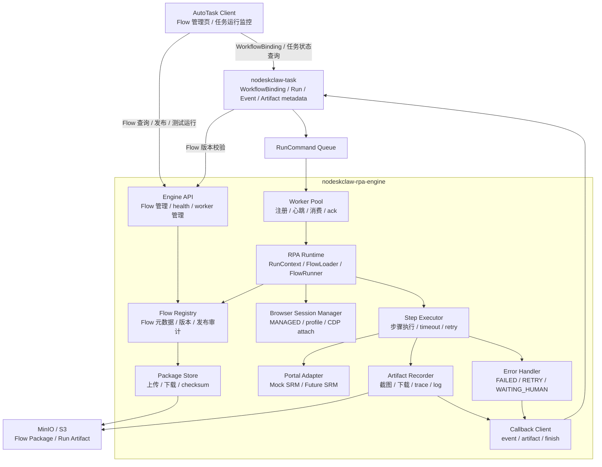

# AutoTask RPA Engine 功能模块建设计划

## 1. 目标

本文用于规划 `nodeskclaw-rpa-engine` 的功能模块、建设顺序、交付物和验收标准。

核心目标：

```text
1. 建成独立 RPA Engine 服务。
2. Flow 管理、Flow Registry、Flow Package 管理由 RPA Engine 负责。
3. nodeskclaw-task 只负责业务任务、WorkflowBinding、RunCommand、RunEvent、Artifact metadata。
4. Worker Pool 作为 RPA Engine 内部模块消费任务并执行 RPA Flow。
5. 首版采用 PLAYWRIGHT_CDP + MANAGED Browser Session 打通 Mock SRM 端到端闭环，后续扩展 PERSISTENT_PROFILE、CDP_ATTACH 和真实 SRM。
6. 采用成熟框架对标采纳策略，降低纯自研踩坑风险，但不在 P0 引入重型平台依赖。
```

## 2. 模块总览



## 3. 建设原则

```text
1. RPA Engine 管 RPA 技术资产，nodeskclaw-task 管业务任务资产。
2. Flow Package 文件存对象存储，Flow 权威元数据存 RPA Engine Flow Registry。
3. WorkflowBinding 存 nodeskclaw-task，并保存 flowVersionId / checksumSnapshot。
4. Worker 本地目录只做执行缓存，不是权威数据源。
5. RunCommand 必须带运行快照，保证历史任务可追溯。
6. browserSession 必须作为运行快照进入 RunCommand，v0.6 固定 MANAGED。
7. Flow 只能使用 Runtime 注入的 ctx.page，不能自行启动 browser 或 connect_over_cdp。
8. 成熟框架作为设计参照和后续替代路径，不作为 v0.6 运行时强依赖。
9. 第一版支持内部可信 flow.py:run(ctx)，后续再扩展子进程 / 容器隔离。
10. 所有产物统一走 Artifact Recorder，不允许 Flow 私自保存证据。
```

## 4. 成熟框架对标映射

| 参考项目 / 框架 | 采纳能力 | 落地模块 | P0 边界 |
| --- | --- | --- | --- |
| Playwright / CDP | 浏览器自动化、BrowserContext、下载、截图、Trace、CDP 通道 | RPA Runtime、Browser Session Manager | 直接作为执行底座 |
| Robocorp / Sema4 Automation | 包管理、机器人运行、运行记录、Worker 管理 | Flow Registry、Package Store、Release Audit、Worker Pool | 参考模型，不接 Control Room |
| Browserless / Browserbase | 浏览器会话池、远程会话、并发、CDP / Playwright 连接 | Browser Session Manager、browserSession、Worker capability | 参考会话池模型，P0 只做 MANAGED |
| Temporal | Workflow / Activity、可靠执行、重试、超时、幂等 | RunCommand Queue、Worker Pool、Error Handler、Callback Client | 参考语义，不部署 Temporal Server |
| Robot Framework Browser / TagUI | 关键字式自动化、低门槛步骤表达 | Step Executor、Flow SDK、后续 DSL | P0 固定 `flow.py:run(ctx)` |
| OpenRPA / Ui.Vision | 运行监控、证据、人工介入、低代码体验 | AutoTask Client、Artifact Center、HumanAction | 参考产品体验，不作为执行内核 |

结论：

```text
AutoTask RPA Engine 不是纯自研从零开始，也不是直接套用某个 RPA 平台。
P0 采用成熟机制的最小可控实现；P1/P2 再评估是否替换为成熟组件。
```

## 5. 功能模块计划

| 模块 | 归属 | 参考对象 | P0 目标 | P1 / P2 扩展 |
| --- | --- | --- | --- | --- |
| Engine Foundation | RPA Engine | FastAPI / 常规服务工程 | 项目骨架、配置、日志、健康检查、鉴权基础 | 多环境部署、mTLS、灰度配置 |
| Flow Registry | RPA Engine | Robocorp | Flow 元数据、版本、状态、发布审计 | 多租户、审批流、版本差异对比 |
| Package Store | RPA Engine + MinIO | Robocorp / 制品仓库 | Flow zip 上传、下载、checksum、packageUri | 签名校验、病毒扫描、制品仓库适配 |
| Flow Management API | RPA Engine | Robocorp Control Room | Flow 列表、详情、发布、禁用、回滚、测试运行 API | Webhook、CI/CD 发布 |
| Worker Pool | RPA Engine | Temporal Worker / Robocorp Worker | 注册、心跳、消费 RunCommand、ack / retry / dead letter | 并发池、优先级、能力调度 |
| Callback Client | RPA Engine | Temporal 幂等回调思想 | 回写 RunEvent、Artifact metadata、finish | 幂等重放、批量上报、断点续传 |
| RPA Runtime | RPA Engine | Playwright / Robocorp Python automation | 创建 RunContext、加载 Flow、执行 `run(ctx)` | 子进程隔离、容器隔离、资源限额 |
| Browser Session Manager | RPA Engine | Browserless / Browserbase | PLAYWRIGHT_CDP、MANAGED 模式、context、page、download、trace | PERSISTENT_PROFILE、CDP_ATTACH、远程浏览器 |
| Step Executor / Flow SDK | RPA Engine | Robot Framework Browser / TagUI | 标准 ctx、事件、超时、重试、基础 step helper | DSL 编排、可视化步骤、录制回放 |
| Portal Adapter | RPA Engine | Page Object / Adapter 模式 | Mock SRM adapter、selectors、登录 / 查询 / 下载 | 真实客户 SRM adapter、Portal 能力矩阵 |
| Artifact Recorder | RPA Engine | Robocorp run artifact / OpenRPA 证据体验 | 截图、下载、trace、日志上传，metadata 回调 | 大文件分片、生命周期策略、脱敏 |
| Error Handler | RPA Engine | Temporal retry / failure handling | 异常分类、状态映射、WAITING_HUMAN | 智能诊断、失败聚类、自动修复建议 |
| Observability | RPA Engine | Temporal / Browserless 运行观测 | 结构化日志、runId 链路、基础 metrics | Prometheus / Grafana、告警、SLA |
| Test Harness | RPA Engine | Playwright Test / Mock Server | Mock SRM、E2E demo、单元测试 | 压测、兼容性测试、回归基线 |

## 6. 分阶段计划

### Phase 0：架构冻结与接口契约

周期建议：2-3 天。

交付物：

```text
1. RPA Engine 模块边界确认。
2. Flow Registry / WorkflowBinding / RunCommand 数据契约。
3. RunEvent / Artifact metadata / finish Callback API 契约。
4. browserSession 数据契约：MANAGED / PERSISTENT_PROFILE / CDP_ATTACH。
5. Worker capability 契约：PLAYWRIGHT_CDP / BROWSER_SESSION_MANAGED。
6. 成熟框架能力映射确认：Robocorp、Browserless / Browserbase、Temporal、Robot Framework Browser / TagUI。
7. Flow Package manifest 规范。
8. Mock SRM 验证场景定义。
```

验收：

```text
1. 能画清 Client、nodeskclaw-task、RPA Engine、MinIO、Queue 的关系。
2. RunCommand payload 包含 flowVersionId、packageUri、checksum、input、credentialRef、browserSession。
3. v0.6 明确只实现 browserSession.mode = MANAGED。
4. 每个核心模块都有成熟框架参照和 P0 边界说明。
5. RPA Flow 开发规范与 Engine PRD 无冲突。
```

### Phase 1：Engine Foundation

周期建议：3-5 天。

范围：

```text
1. 新建 nodeskclaw-rpa-engine 项目。
2. FastAPI 启动入口。
3. pydantic-settings 配置。
4. 结构化日志。
5. health / readiness API。
6. 本地 SQLite Flow Registry DB。
7. MinIO / S3 client 基础封装。
8. 与 nodeskclaw-task 的服务账号鉴权骨架。
```

验收：

```text
1. RPA Engine 可本地启动。
2. health API 返回正常。
3. 配置项可通过 .env 切换。
4. 日志包含 runId / workerId / flowVersionId 字段预留。
```

### Phase 2：Flow Registry 与 Flow 管理 API

周期建议：1-1.5 周。

范围：

```text
1. Flow 元数据表。
2. Flow Version 元数据表。
3. Flow Release Audit 表。
4. 上传 RPA Flow Package。
5. 校验 manifest.json。
6. 校验 entrypoint。
7. 生成 checksum。
8. 上传 package 到 MinIO。
9. 生成 packageUri。
10. Flow 状态流转：DRAFT / VALIDATING / PUBLISHED / DEPRECATED / DISABLED。
11. Flow 列表、详情、版本、发布、禁用、回滚 API。
12. 给 nodeskclaw-task 提供版本校验 API。
```

验收：

```text
1. RPA 工程师可通过 CLI 或 API 发布一个 Flow。
2. 同一 rpaFlowId + version 不允许覆盖。
3. 错误 manifest 会被拒绝并返回明确原因。
4. PUBLISHED 的 Flow 可被 nodeskclaw-task 查询和绑定。
5. packageUri / checksum / rpaFlowVersionId 可稳定生成。
```

### Phase 3：Worker Pool 与 Queue 集成

周期建议：1 周。

范围：

```text
1. Worker 实例注册。
2. heartbeat。
3. Worker 状态：online / busy / offline。
4. Worker capability 注册：PLAYWRIGHT_CDP / BROWSER_SESSION_MANAGED。
5. Queue consumer。
6. RunCommand 消费。
7. 校验 RunCommand.browserSession.mode 与 Worker capability 匹配。
8. ack / retry / visibility timeout / dead letter。
9. 并发数配置。
10. Worker Pool 与 RPA Runtime 的调用接口。
```

验收：

```text
1. nodeskclaw-task 投递 RunCommand 后，Worker Pool 可消费。
2. Worker Pool 可将任务置为 RUNNING。
3. Worker 不具备对应 browserSession capability 时拒绝执行并上报明确错误。
4. 执行成功后 ack。
5. 执行异常后按策略 retry 或 dead letter。
6. Worker 崩溃后消息可重新可见。
```

### Phase 4：Runtime、PLAYWRIGHT_CDP Browser Session、Artifact、Error 闭环

周期建议：1.5-2 周。

范围：

```text
1. FlowLoader 根据 flowVersionId 加载 Flow。
2. 本地缓存目录按 rpaFlowId / version / checksum 管理。
3. 校验 checksum。
4. 解压 package。
5. import flow.py 并调用 async run(ctx)。
6. 创建 RunContext。
7. Browser Session Manager 解析 RunCommand.browserSession。
8. 实现 MANAGED 模式：启动 Playwright Chromium。
9. 创建独立 BrowserContext / Page。
10. 管理 download 目录、trace、headless/headful、channel。
11. Run 结束后按 CLOSE_ON_FINISH 关闭 browser/context/page。
12. 定义 BrowserProfile / CdpEndpointRef 数据结构，但 v0.6 不启用。
13. 预留 PERSISTENT_PROFILE / CDP_ATTACH 接口，不连接外部 Chrome。
14. Artifact Recorder 保存截图、下载、trace、日志。
15. Error Handler 映射 retry / FAILED / WAITING_HUMAN。
16. Callback Client 回写 event / artifact / finish。
```

验收：

```text
1. 一个最小 Flow 可被下载、缓存、加载并执行。
2. ctx.input / ctx.credentials / ctx.page / ctx.artifacts / ctx.events 可用。
3. browserSession.mode = MANAGED 可启动 Playwright Chromium。
4. Run 完成后浏览器会话按 CLOSE_ON_FINISH 被关闭。
5. Flow 无法访问 profileRef、cdpEndpointRef、userDataDir。
6. 截图和下载文件可上传到 Artifact Storage。
7. RunEvent 可在 AutoTask 运行监控中看到。
8. 失败能生成失败截图和错误事件。
```

### Phase 5：Mock SRM 验证流

周期建议：1 周。

范围：

```text
1. Mock SRM 页面。
2. MockSrmAdapter。
3. selectors.json。
4. srm.login。
5. srm.search_po。
6. file.download。
7. evidence.screenshot。
8. CAPTCHA / MFA / 人工处理模拟。
9. 成功、失败、WAITING_HUMAN 三条演示流程。
```

验收：

```text
1. PO 查询成功任务进入 SUCCESS。
2. PO 不存在任务进入 FAILED。
3. CAPTCHA / MFA 场景进入 WAITING_HUMAN。
4. AutoTask 可看到运行日志和证据文件。
```

### Phase 6：Flow 管理页面与绑定体验

周期建议：1 周。

范围：

```text
1. AutoTask Client 增加 Flow 管理入口。
2. Flow 列表。
3. Flow 版本列表。
4. Flow 发布 / 禁用 / 回滚入口。
5. WorkflowTemplate + PortalAccount + FlowVersion 绑定。
6. 绑定时调用 RPA Engine 校验 Flow 状态。
7. 展示 checksum、版本、发布人、发布时间。
```

验收：

```text
1. 用户可在 Client 选择已发布 Flow 版本并创建 WorkflowBinding。
2. 禁用版本不能新建绑定。
3. 回滚绑定后，新任务使用旧版本。
4. 历史任务仍显示当时使用的 flowVersionId 和 checksumSnapshot。
```

### Phase 7：Profile、CDP Attach 与生产化增强

周期建议：1-2 周，按项目压力分批进入 v0.7 / v0.8。

范围：

```text
1. v0.7 实现 PERSISTENT_PROFILE 登录态复用。
2. v0.7 实现 BrowserProfile 管理和 profileRef 权限隔离。
3. v0.7 接入第一个真实 SRM Portal Adapter。
4. v0.8 评估并实现 CDP_ATTACH 接管受控 Chrome。
5. v0.8 支持 Local Host / 人工登录后接管场景。
6. Worker Pool 并发限制。
7. 任务优先级。
8. Portal 能力标签调度。
9. Flow Package 签名校验。
10. 运行超时和浏览器资源回收。
11. 日志、metrics、trace。
12. 失败重试策略配置化。
13. Artifact 生命周期策略。
14. 凭证服务接入。
```

验收：

```text
1. 多 Worker 实例可同时运行。
2. 任务不会因单个浏览器异常拖垮整个 Engine。
3. PERSISTENT_PROFILE 场景能按 profileRef 隔离登录态。
4. CDP_ATTACH 场景只能连接受控 endpoint。
5. 可定位一次运行的完整日志、事件、截图、trace。
6. Flow 发布、绑定、执行、回滚都有审计记录。
```

## 7. 模块依赖关系

```text
Engine Foundation
  -> Flow Registry
  -> Package Store
  -> Worker Pool
  -> RPA Runtime
  -> Browser Session Manager
  -> Artifact Recorder
  -> Error Handler
  -> Mock SRM E2E

nodeskclaw-task 侧依赖：
  WorkflowBinding
  RunCommand Queue
  Worker Callback API
  RunEvent / Artifact metadata / finish

AutoTask Client 侧依赖：
  Flow 管理页面
  WorkflowBinding 页面
  运行监控页面
  证据中心页面
```

## 8. P0 最小闭环

P0 不追求完整平台能力，只要求能真实跑通。

```text
1. Flow 发布到 RPA Engine。
2. Flow Package 存 MinIO。
3. nodeskclaw-task 创建 WorkflowBinding。
4. nodeskclaw-task 投递 RunCommand。
5. Worker Pool 消费任务。
6. Runtime 下载 / 缓存 / 校验 / 加载 Flow。
7. Browser Session Manager 以 MANAGED 模式启动 Playwright Chromium。
8. RunContext 只向 Flow 注入 ctx.page，不暴露 profileRef / cdpEndpointRef。
9. Flow 执行 Mock SRM。
10. Artifact Recorder 上传截图和下载文件。
11. Callback Client 回写 RunEvent / Artifact metadata / finish。
12. AutoTask Client 展示状态、日志、证据。
```

## 9. 风险与应对

| 风险 | 影响 | 应对 |
| --- | --- | --- |
| Flow 管理和任务绑定边界混乱 | 后续模块互相污染 | Engine 管 Flow 权威元数据，task 只存绑定快照 |
| 方案被认为是纯自研 | 决策风险高，领导担心踩坑 | 将成熟框架能力映射写入 PRD 和开发计划，按模块采纳成熟机制 |
| 成熟框架引入过重 | 部署复杂、集成成本高、首版延期 | P0 只对标采纳，不引入 Robocorp / Temporal / Browserless 等运行依赖 |
| 多框架拼盘导致架构失控 | 接口割裂，运行链路难排障 | 对外保持 AutoTask 自有模型：Flow Registry、RunCommand、Artifact、HumanAction |
| 每次运行都下载 Flow | 性能差，MinIO 压力大 | 使用 rpaFlowId + version + checksum 本地缓存 |
| Flow 脚本随意访问系统资源 | 安全风险 | v0.6 限内部可信 Flow，v0.7+ 增加子进程 / 容器隔离 |
| Flow 绕过 Browser Session Manager 直接启动浏览器或 CDP | 会话失控、凭证泄露 | Flow 只能使用 ctx.page；发布校验禁止 connect_over_cdp 和启动 browser |
| CDP endpoint 暴露 | 浏览器可被完全接管 | v0.6 不启用 CDP_ATTACH；后续 endpointRef 只由 Engine 解析，绑定本机或受控内网 |
| Profile 复用导致客户登录态串用 | 严重权限风险 | v0.6 不启用 PERSISTENT_PROFILE；v0.7 按 portalAccountId/profileRef/Worker capability 隔离 |
| Artifact 大文件走业务 API | task 服务压力大 | 大文件直传 MinIO，task 只存 metadata |
| 真实 SRM 不稳定 | 首版验证被拖慢 | 第一条 Flow 使用 Mock SRM，真实 SRM 放 v0.7 |
| Worker 崩溃导致任务卡死 | 任务状态不一致 | Queue visibility timeout + dead letter + 幂等 finish |
| WAITING_HUMAN 语义不清 | 人工处理流程混乱 | v0.6 只暂停并交给人工，不恢复原浏览器上下文 |

## 10. 建议排期

```text
第 1 周：
  Phase 0 + Phase 1
  完成架构契约、项目骨架、配置、health、基础存储。

第 2 周：
  Phase 2
  完成 Flow Registry、Package Store、Flow 发布和版本管理。

第 3 周：
  Phase 3
  完成 Worker Pool、Queue 消费、Callback API 基础闭环。

第 4-5 周：
  Phase 4
  完成 Runtime、PLAYWRIGHT_CDP Browser Session MANAGED 模式、Artifact Recorder、Error Handler。

第 6 周：
  Phase 5
  完成 Mock SRM 成功 / 失败 / WAITING_HUMAN 演示流。

第 7 周：
  Phase 6
  完成 Client Flow 管理入口和 WorkflowBinding 体验。

第 8 周以后：
  Phase 7
  进入 PERSISTENT_PROFILE、CDP_ATTACH、并发、监控、安全、真实 SRM 接入。
```

## 11. 第一阶段拆工建议

第一批可以拆成 5 条并行线：

```text
1. Engine 基建线：
   项目骨架、配置、日志、health、鉴权。

2. Flow Registry 线：
   元数据表、发布 API、manifest 校验、MinIO package。

3. Worker Runtime 线：
   Queue consumer、Worker Pool、RunContext、FlowLoader。

4. Browser Session & Artifact 线：
   PLAYWRIGHT_CDP、MANAGED Browser Session、BrowserContext/Page、closePolicy、Artifact Recorder、MinIO artifact。

5. Demo & 集成线：
   Mock SRM、测试 Flow、nodeskclaw-task RunCommand、AutoTask 展示。
```

优先级最高的是第 2 条和第 3 条。没有 Flow Registry，Flow 不可管理；没有 Worker Runtime，任务不可执行。
