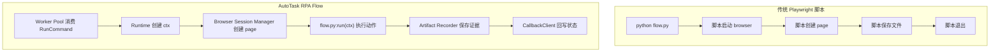
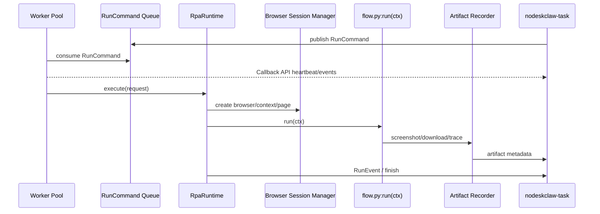
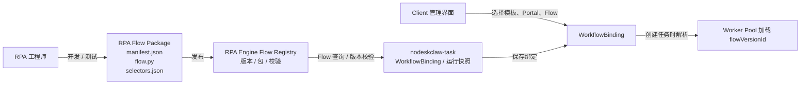

# RPA Flow 开发规范

## 1. 目的

本规范面向 RPA 工程师，定义 Playwright 脚本如何交付给 AutoTask RPA Engine。

核心结论：

```text
RPA 工程师交付的不是一个孤立 Playwright 脚本，而是一个可被平台加载、调度、追踪、审计和回滚的 RPA Flow Package。
```

传统 Playwright 脚本可以直接启动浏览器并执行动作，但不适合平台化。AutoTask 要求脚本必须能被 `nodeskclaw-rpa-engine` 接管，并纳入 `nodeskclaw-task` 的任务状态、运行事件和证据管理。

本规范中出现的 `Worker`，均指 RPA Engine 内部 Worker Pool 的可注册执行实例，不指独立服务或独立项目。

### 1.1 成熟框架写法参考

AutoTask RPA Flow 的当前入口固定为 `flow.py:run(ctx)`，但 Flow SDK 和后续 Step DSL 会参考成熟框架的写法经验：

| 参考框架 | 可借鉴点 | AutoTask 采纳方式 |
| --- | --- | --- |
| Robot Framework Browser | 关键字式浏览器操作、可读性强、适合测试 / RPA 工程师 | 后续 Step DSL 可参考其关键字表达，但 v0.6 不要求编写 `.robot` 文件 |
| TagUI | 低门槛脚本式 RPA、接近自然语言步骤 | 后续可参考其简洁语法，但不作为执行 runtime |
| Robocorp | Python automation 包管理、运行记录、任务交付规范 | 参考 Flow Package、manifest、版本和发布校验 |
| Playwright | 浏览器自动化 API、locator、download、screenshot、trace | v0.6 作为实际执行底座 |

结论：

```text
RPA 工程师 v0.6 只需要遵守 AutoTask Flow Package 和 flow.py:run(ctx) 规范。
Robot Framework Browser / TagUI 是后续 DSL 体验参考，不是当前交付格式。
```

## 2. 平台化运行模型



传统脚本运行模型：

```text
python flow.py
  启动 Playwright
  启动 Browser
  创建 Page
  执行页面动作
  保存文件
  关闭 Browser
```

AutoTask RPA Flow 运行模型：



```text
Worker Pool / WorkerDaemon 消费 RunCommand
RpaRuntime 创建 RunContext
Browser Session Manager 创建 browser / context / page
FlowLoader 加载 RPA Flow Package
Step Executor / FlowRunner 调用 flow.py:run(ctx)
Artifact Recorder 保存截图 / 下载 / Trace / 日志
ErrorHandler 映射 retry / FAILED / WAITING_HUMAN
CallbackClient 回写 RunEvent / Artifact / finish
```

因此脚本只负责页面动作，平台负责生命周期。

## 3. 交付目录

每个 Flow 必须以版本化包交付：

```text
rpa_flows/
  rpa_flow_customer_a_fetch_po/
    1.0.0/
      manifest.json
      flow.py
      selectors.json
      tests/
```

目录说明：

```text
manifest.json
  Flow 元数据、入口、输入参数、能力声明。

flow.py
  标准执行入口，必须暴露 async def run(ctx)。

selectors.json
  页面 selector、菜单路径、字段定位配置。

tests/
  Flow 的本地测试和 Mock Portal 测试。
```

## 4. manifest.json

示例：

```json
{
  "rpaFlowId": "rpa_flow_customer_a_fetch_po",
  "name": "客户 A SRM 获取采购订单",
  "version": "1.0.0",
  "engineType": "PLAYWRIGHT_CDP",
  "entrypoint": "flow.py:run",
  "supportedWorkflowCodes": ["srm_fetch_po"],
  "supportedPortalTypes": ["CUSTOMER_SRM"],
  "inputSchema": [
    { "name": "po_no", "type": "string", "required": true }
  ],
  "capabilities": ["screenshot", "download", "trace"]
}
```

字段要求：

```text
rpaFlowId
  全局唯一 Flow 标识，不随版本变化。

version
  语义化版本，例如 1.0.0、1.0.1、1.1.0。

engineType
  v0.6 固定为 PLAYWRIGHT_CDP。

entrypoint
  标准入口，v0.6 使用 flow.py:run。

supportedWorkflowCodes
  可绑定的业务模板 code。

inputSchema
  Flow 需要的输入参数。

capabilities
  Flow 使用的能力，例如 screenshot、download、trace、upload。
```

## 5. 标准入口

Flow 必须暴露：

```python
async def run(ctx):
    ...
```

示例：

```python
async def run(ctx):
    page = ctx.page
    po_no = ctx.input["po_no"]

    await page.goto(ctx.portal_url)
    await page.fill(ctx.selectors["po_input"], po_no)
    await page.click(ctx.selectors["search_button"])

    await ctx.artifacts.screenshot("po_search_result")
```

入口函数要求：

```text
1. 只能通过 ctx 获取任务输入、凭证、page、selector、Artifact Recorder。
2. 不得自己启动 browser。
3. 不得直接调用 connect_over_cdp 或读取 cdpEndpointRef。
4. 不得直接读写业务数据库。
5. 不得直接调用 nodeskclaw-task 修改任务状态。
6. 不得读取明文密码文件。
7. 不得绕过 Artifact Recorder 保存截图、下载文件和 Trace。
```

## 6. RunContext

`ctx` 是 RPA Runtime 注入给 Flow 的运行上下文。

```text
ctx.input
  任务输入，例如 po_no、delivery_no、invoice_no。

ctx.credentials
  由 credentialRef 临时解析的凭证，仅在 RPA Engine 运行进程内存中使用。

ctx.page
  Browser Session Manager 创建好的 Playwright Page。

ctx.portal_url
  当前 Portal 入口地址。

ctx.selectors
  selectors.json 中的定位配置。

ctx.artifacts
  Artifact Recorder，用于截图、下载、Trace 和日志。

ctx.log
  运行日志接口。

ctx.events
  运行事件接口。

ctx.config
  WorkflowBinding / RPA Flow 运行配置。
```

## 7. Artifact 规范

脚本必须通过 `ctx.artifacts` 生成证据。

截图：

```python
await ctx.artifacts.screenshot("po_search_result")
```

下载：

```python
async with ctx.page.expect_download() as download_info:
    await ctx.page.click(ctx.selectors["download_contract"])

download = await download_info.value
await ctx.artifacts.save_download(download, "contract.pdf")
```

原则：

```text
1. Worker 只保存运行期临时文件。
2. nodeskclaw-task 只保存 Artifact metadata。
3. 不把截图、下载文件、Trace 通过业务 API 直接传输。
4. Artifact Recorder 必须使用 upload-url 上传 MinIO / S3 / 企业对象存储。
5. 只在关键步骤、失败、人工介入前截图。
6. Trace 默认只在失败或调试模式开启。
7. Worker 临时目录不是权威存储，任务结束后可清理。
```

## 8. 异常规范

Flow 应使用标准异常表达结果。

```text
RpaRetryableError
  可重试错误，例如网络抖动、临时超时。

RpaBusinessError
  明确业务失败，例如 PO 不存在、权限不足。

RpaHumanRequiredError
  需要人工介入，例如验证码、MFA、人工确认。

RpaFatalError
  致命错误，例如脚本配置错误、无法恢复的运行错误。
```

映射规则：

```text
Timeout / 网络抖动 / 下载偶发失败
  -> retry

PO 不存在 / 参数错误 / 权限不足
  -> FAILED

验证码 / MFA / 需要人工确认
  -> WAITING_HUMAN

浏览器崩溃 / Worker 退出
  -> Queue visibility timeout 后重试，或进入 WAITING_RETRY / dead letter
```

脚本不得吞掉异常。无法处理时应抛出标准异常或让 Runtime 捕获原始异常。

## 9. 必须、建议、禁止

必须：

```text
1. 每个 Flow 必须有 manifest.json。
2. 每个 Flow 必须暴露 async def run(ctx)。
3. 输入必须从 ctx.input 获取。
4. 凭证必须从 ctx.credentials 获取。
5. Playwright Page 必须使用 ctx.page。
6. Artifact 必须通过 ctx.artifacts 保存。
7. 异常必须交给 Runtime 处理。
```

建议：

```text
1. selector 放 selectors.json。
2. 客户差异放 Adapter。
3. 每个 Flow 提供 Mock Portal 测试。
4. 每个 Flow 记录关键步骤日志。
5. 版本升级遵守 semver。
```

禁止：

```text
1. hardcode 账号密码。
2. 自己启动 browser。
3. 直接连接业务数据库。
4. 直接修改任务状态。
5. 私自上传文件到未知地址。
6. 捕获异常后不上报。
7. 每个 click 都截图。
```

## 10. 发布与绑定

### 10.1 总体流程



发布流程：

```text
1. RPA 工程师开发 Flow。
2. 本地测试通过。
3. 打包 RPA Flow Package。
4. 发布到 RPA Engine Flow Registry。
5. RPA Engine 记录 RPA Flow 元数据、manifest、packageUri、checksum 和发布审计。
6. Client 选择 WorkflowTemplate + PortalAccount + RPA Flow。
7. nodeskclaw-task 调用 RPA Engine Flow API 校验版本可绑定，并创建 WorkflowBinding。
8. Worker Pool 根据 flowVersionId 或 rpaFlowId / rpaFlowVersion 加载 Flow。
```

### 10.2 Flow Registry 职责

Flow Registry 是 RPA Engine 内部的中心化 Flow 管理模块，不是 Worker 本机目录，也不是 `nodeskclaw-task` 业务数据库。

Flow 管理页面可以放在 AutoTask Client 中，但 Flow 发布、版本、禁用、回滚、校验、测试运行等 API 归 RPA Engine。`nodeskclaw-task` 只在创建 WorkflowBinding 和任务运行时读取 Flow 引用快照。

它负责：

```text
1. 保存 RPA Flow Package 文件。
2. 按 rpaFlowId / version 管理版本。
3. 校验 manifest.json。
4. 校验 entrypoint 是否存在。
5. 计算 package checksum。
6. 保存 Flow 元数据、packageUri、发布状态和发布审计。
7. 向 nodeskclaw-task 提供 Flow 查询、版本校验和绑定校验 API。
8. 支持多个 Worker Pool 执行实例根据 packageUri 拉取 Flow。
```

生产导向结构：

```text
rpa-engine-flow-registry/
  rpa_flow_customer_a_fetch_po/
    1.0.0/
      rpa_flow_customer_a_fetch_po-1.0.0.zip
      manifest.json
      package.meta.json
      checksum.sha256
```

推荐实现：

```text
Flow Package：
  存对象存储 / Git 仓库 / 制品仓库。

Flow Metadata：
  存 RPA Engine Flow Registry。

Worker：
  只保留本地缓存，不作为权威 Registry。
```

### 10.3 发布步骤

RPA 工程师发布一个 Flow 时，过程建议如下：

```text
1. 开发 Flow
   编写 manifest.json、flow.py、selectors.json、tests。

2. 本地验证
   运行 lint、manifest 校验、Mock Portal 测试。

3. 打包
   生成 rpa_flow_id/version 的 package 目录或 zip 包。

4. 提交发布
   将 package 上传到 RPA Engine Flow Registry。

5. Registry 校验
   校验 manifest、入口、版本号、输入参数、禁止项、checksum。

6. Registry 入库
   保存 package，生成 package.meta.json、checksum 和 packageUri。

7. 发布生效
   RPA Engine 保存 Flow 元数据、状态和发布审计。

8. 待绑定
   Client 管理界面可通过 nodeskclaw-task 代理查询该 Flow 版本。

9. 创建 WorkflowBinding
   绑定 WorkflowTemplate + PortalAccount + RPA Flow version。

10. Worker Pool 执行
   任务下发时带 flowVersionId 或 rpaFlowId / rpaFlowVersion / packageUri 快照，Worker Pool 执行实例拉取并缓存。
```

### 10.4 发布命令示例

v0.6 可以先提供一个 CLI 或管理脚本：

```powershell
rpa-flow publish `
  --package .\rpa_flows\rpa_flow_customer_a_fetch_po\1.0.0 `
  --registry https://rpa-engine.internal/api/v1/flows
```

如果还没有完整 Registry UI，也必须通过 RPA Engine 的发布 API 或 CLI 写入共享制品位置，而不是某台 Worker 本机目录：

```text
upload package -> shared artifact storage / Git release / artifact repository
validate manifest
write package.meta.json
POST nodeskclaw-rpa-engine /flows/releases
```

### 10.5 Registry 校验项

发布时必须校验：

```text
1. manifest.json 存在且可解析。
2. rpaFlowId 与目录名一致。
3. version 符合 semver。
4. engineType = PLAYWRIGHT_CDP。
5. entrypoint 指向的文件和函数存在。
6. inputSchema 字段完整。
7. supportedWorkflowCodes 不为空。
8. flow.py 不包含明显禁止项，例如直接启动 browser、数据库连接字符串、明文密码。
9. selectors.json 可解析。
10. tests 至少包含 Mock Portal 成功用例。
11. package checksum 可生成。
12. 同一 rpaFlowId + version 不允许覆盖发布。
```

### 10.6 Flow 元数据与绑定快照

Flow Registry 保存的是包文件和 Flow 权威元数据，归 RPA Engine 管理。`nodeskclaw-task` 不读取 Worker 本机文件，也不作为 Flow Registry 的权威数据源。

RPA Engine Flow Registry 建议保存：

```json
{
  "rpaFlowVersionId": "rfv_customer_a_fetch_po_1_0_0",
  "rpaFlowId": "rpa_flow_customer_a_fetch_po",
  "version": "1.0.0",
  "name": "客户 A SRM 获取采购订单",
  "engineType": "PLAYWRIGHT_CDP",
  "entrypoint": "flow.py:run",
  "packageUri": "https://rpa-engine.internal/flow-packages/rpa_flow_customer_a_fetch_po/1.0.0/package.zip",
  "checksum": "sha256:...",
  "supportedWorkflowCodes": ["srm_fetch_po"],
  "supportedPortalTypes": ["CUSTOMER_SRM"],
  "inputSchema": [
    { "name": "po_no", "type": "string", "required": true }
  ],
  "capabilities": ["screenshot", "download", "trace"],
  "status": "PUBLISHED"
}
```

`nodeskclaw-task` 中的 `WorkflowBinding` 只保存绑定关系和运行快照：

```json
{
  "workflowBindingId": "wfb_customer_a_fetch_po",
  "workflowTemplateId": "wf_srm_fetch_po",
  "portalAccountId": "portal_customer_a",
  "rpaFlowVersionId": "rfv_customer_a_fetch_po_1_0_0",
  "rpaFlowId": "rpa_flow_customer_a_fetch_po",
  "rpaFlowVersion": "1.0.0",
  "checksumSnapshot": "sha256:...",
  "status": "ENABLED"
}
```

状态建议：

```text
DRAFT
  已上传但未发布。

PUBLISHED
  可被 WorkflowBinding 选择。

DEPRECATED
  不建议新绑定，但已有任务仍可运行。

DISABLED
  禁止新任务使用。
```

### 10.7 Worker 加载过程

任务执行时，`nodeskclaw-task` 下发：

```json
{
  "taskId": "task_001",
  "runId": "run_001",
  "workflowBindingId": "wfb_001",
  "rpaFlowVersionId": "rfv_customer_a_fetch_po_1_0_0",
  "rpaFlowId": "rpa_flow_customer_a_fetch_po",
  "rpaFlowVersion": "1.0.0",
  "packageUri": "https://rpa-engine.internal/flow-packages/rpa_flow_customer_a_fetch_po/1.0.0/package.zip",
  "packageChecksum": "sha256:...",
  "browserSession": {
    "mode": "MANAGED",
    "headless": true,
    "channel": "chromium",
    "profileRef": null,
    "cdpEndpointRef": null
  },
  "input": {
    "po_no": "PO-001"
  }
}
```

Worker 加载步骤：

```text
1. 根据 rpaFlowVersionId 或 rpaFlowId / rpaFlowVersion 查找本地缓存。
2. 缓存不存在或 checksum 不匹配时，通过 RPA Engine Flow Registry 解析 packageUri 并拉取 package。
3. 校验 checksum。
4. 解压到 Worker 本地缓存目录。
5. 读取 manifest.json。
6. 解析 entrypoint。
7. import flow.py。
8. 创建 RunContext。
9. 调用 async run(ctx)。
```

Worker 本地缓存只用于加速和离线容错，不是权威数据源。缓存可随时清理，重新从 `packageUri` 拉取。

### 10.8 版本升级与回滚

发布规则：

```text
1. rpaFlowId + version 不可覆盖。
2. 修 bug 发布 patch 版本，例如 1.0.1。
3. 输入参数兼容升级发布 minor 版本，例如 1.1.0。
4. 破坏性变更发布 major 版本，例如 2.0.0。
5. WorkflowBinding 绑定具体版本，不自动漂移到 latest。
6. 回滚只需要把 WorkflowBinding 指回旧版本。
```

这样可以保证：

```text
旧任务可追溯当时使用的脚本版本。
新脚本发布不会影响正在运行或历史任务。
客户 A 的 Flow 升级不会影响客户 B。
```

### 10.9 权限与审计

发布 Flow 需要 RPA 工程师权限。

必须记录审计：

```text
谁发布
何时发布
rpaFlowId
version
checksum
manifest 摘要
测试结果
是否启用
谁创建 / 修改 WorkflowBinding
```

Flow 发布不等于业务用户可用。只有创建 `WorkflowBinding` 后，业务任务才会使用该 Flow。

### 10.10 绑定关系示例

绑定关系示例：

```json
{
  "workflowTemplateId": "wf_srm_fetch_po",
  "portalAccountId": "portal_customer_a",
  "rpaEngineType": "PLAYWRIGHT_CDP",
  "rpaFlowVersionId": "rfv_customer_a_fetch_po_1_0_0",
  "rpaFlowId": "rpa_flow_customer_a_fetch_po",
  "rpaFlowVersion": "1.0.0",
  "checksumSnapshot": "sha256:...",
  "status": "ENABLED",
  "config": {
    "timeoutSeconds": 120,
    "retryTimes": 2,
    "browserSession": {
      "mode": "MANAGED",
      "headless": true,
      "channel": "chromium",
      "profileRef": null,
      "cdpEndpointRef": null
    }
  }
}
```

## 11. 验收标准

一个 RPA Flow 可发布前必须满足：

```text
1. manifest.json 可解析。
2. entrypoint 可加载。
3. async def run(ctx) 可执行。
4. 输入参数校验通过。
5. 成功流程可完成。
6. 失败流程可映射 FAILED。
7. 人工流程可映射 WAITING_HUMAN。
8. 截图、下载、Trace 通过 Artifact Recorder 生成。
9. 不直接启动 browser。
10. 不直接 connect_over_cdp。
11. 不直接访问业务数据库。
12. 不包含明文密码。
13. 有本地测试或 Mock Portal 测试。
```
