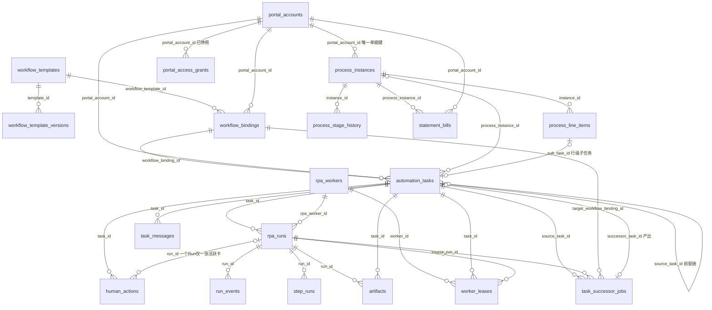
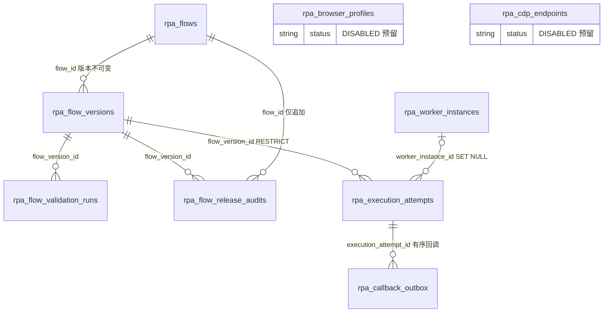
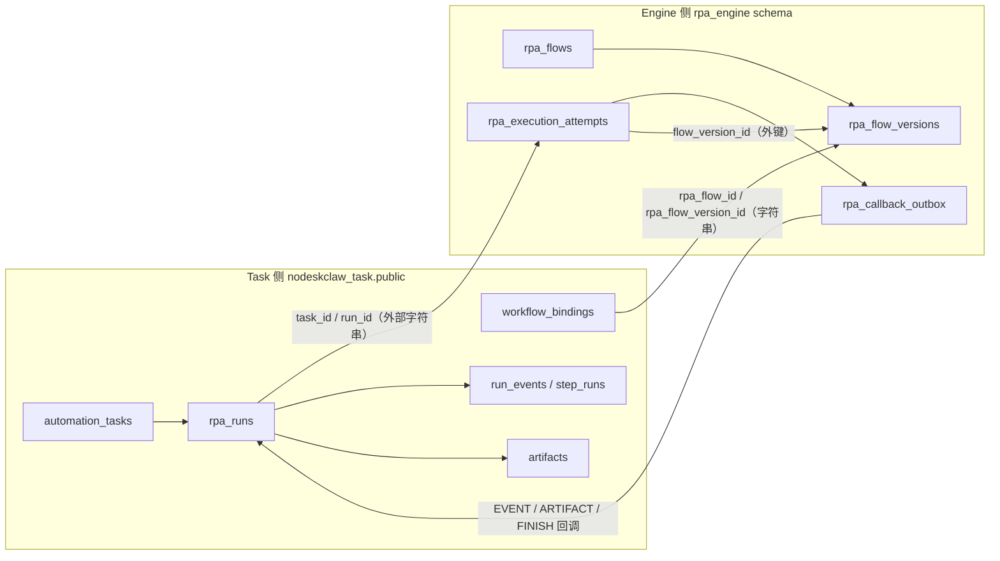

# 系统表设计总览（关联关系与职责）

最后更新：2026-08-24

本文档描述 AutoTask 全系统的表设计，只讲**关联关系和职责**，不含字段字典。
数据来源：`service/app/models/`（Task 侧）与 `rpa-engine/src/nodeskclaw_rpa_engine/db/models/`（Engine 侧）的 SQLAlchemy 模型。

## 1. 数据域划分

| 数据域 | 数据库 / Schema | 表数 | 职责 |
| --- | --- | --- | --- |
| 任务业务侧（`service/`） | PostgreSQL `nodeskclaw_task` / public | 23 | 任务业务、WorkflowBinding、Run 权威、Artifact 元数据、HumanAction、流程实例、对账单 |
| RPA Engine 侧（`rpa-engine/`） | 同库 / `rpa_engine` schema | 9 | Flow Registry、Flow 版本、执行尝试权威、回调 Outbox、Worker 内部状态 |
| 用户 / 组织 / 权限 | nodeskclaw-backend（Auth 服务，不在本工作区） | - | 权威数据在外部；Task 侧仅有 `autotask_user_cache` 缓存 |

两条通用规则：

1. Task 侧所有表统一：UUID 主键 + 软删除（`deleted_at`）+ 时间戳；**表间不建数据库外键，关联靠 ID 字符串引用**。
2. Engine 侧表用原生 UUID 主键，**schema 内建外键**；跨服务引用（tenantId、taskId、runId、portalAccountId、userId、WorkflowBindingId）一律是外部字符串，无外键。

## 2. Task 侧 ER 总图（service/，23 张）

## 3. Task 侧表职责速查

### 3.1 工作流定义层（"做什么"）

| 表 | 职责 | 关联 |
| --- | --- | --- |
| `workflow_templates` | 业务工作流模板：步骤定义、输入 schema | 租户内 `tenant_id + code` 唯一（软删过滤） |
| `workflow_template_versions` | 模板版本快照，历史留档 | → `template_id` |
| `workflow_bindings` | **核心枢纽**：绑定「门户账号 × 模板版本 × RPA Flow 版本」；`config` 存运行参数（样例单号、dryRun、searches 等）；`rpa_flow_version_id` + `flow_checksum_snapshot` 精确钉住 Flow 版本 | → `portal_account_id`、`workflow_template_id`；外部引用 Engine `rpa_flow_id`/`rpa_flow_version_id` |
| `rpa_components` | RPA 组件目录（展示元数据） | 独立 |
| `autotask_settings` | 租户级 KV 配置 | `tenant_id + key` 唯一 |

### 3.2 门户与账号层（"用谁的账号操作"）

| 表 | 职责 | 关联 |
| --- | --- | --- |
| `portal_accounts` | 供应商门户账号：SRM 地址、登录名、凭据引用、客户端会话隔离、`owner_user_id` 归属人（v5.1 权限按此过滤） | `tenant_id + portal_name` 唯一 |
| `portal_access_grants` | 门户授权记录；**v5.1 起停用**，鉴权改按 `owner_user_id` | → `portal_account_id` + 主体 |
| `autotask_user_cache` | 登录用户缓存（外部 Auth `/me`：角色、超管、管理名单） | `user_id` 唯一，独立 |

### 3.3 任务执行层（"跑起来的主线"）

| 表 | 职责 | 关联 |
| --- | --- | --- |
| `automation_tasks` | **业务任务主表**：创建时锁定 Binding 即快照；状态/进度/输入 | → `source_task_id`/`source_run_id`（前驱）、`process_instance_id` |
| `rpa_runs` | 一次 RPA 执行（**Run 权威在 Task 侧**）：命令快照、输出 | → `task_id`、`rpa_worker_id`、`lease_id` |
| `run_events` | Run 时间线事件流（Engine 回调写入） | → `run_id`、`task_id` |
| `step_runs` | Run 内业务步骤状态 | → `run_id`；`run_id + step_id` 唯一 |
| `artifacts` | 产物元数据（截图/XLSX）；实体在 MinIO，`storage_key` 指向对象 | → `task_id`、`run_id`；`run_id + storage_key` 唯一 |
| `human_actions` | 人机协作卡点（如验证码失败） | → `task_id`、`run_id`；一个 Run 仅一张活跃卡（部分唯一） |
| `rpa_workers` | Worker 注册表（**调度权威在 Task 侧**）：心跳、状态、当前 Run | `worker_id` 唯一 |
| `worker_leases` | Worker 领取任务的租约：防重复派发、过期回收 | → `task_id`、`run_id`、`worker_id`；`lease_id` 唯一 |

### 3.4 任务链与消息

| 表 | 职责 | 关联 |
| --- | --- | --- |
| `task_successor_jobs` | **任务 N→N+1 自动链**：源 Run 成功后按 input_mapper 生成后继任务（带重试） | → `source_task_id`/`source_run_id`、`target_workflow_binding_id`；产出 `successor_task_id` |
| `task_messages` | 任务下的留言/备注 | → `task_id` |

### 3.5 业务流程实例（客户订单 / 对账单的"单据视图"）

| 表 | 职责 | 关联 |
| --- | --- | --- |
| `process_instances` | 流程实例（如一张客户订单），六阶段推进 | `portal_account_id + process_code + biz_key` 唯一 |
| `process_line_items` | 行明细（物料、交期、状态），行级派发子任务 | → `instance_id`；`sub_task_id` 回链任务 |
| `process_stage_history` | 阶段流转历史 | → `instance_id` |
| `statement_bills` | 对账单头表：只存本系统创建的，明细由 RPA 实时读 SRM | → `process_instance_id`、`portal_account_id`；`tenant_id + 日期 + 金额` 匹配（SRM 无单号） |

### 3.6 审计

| 表 | 职责 | 关联 |
| --- | --- | --- |
| `audit_logs` | 操作者对任意资源的动作留痕 | → `actor_id` + `resource_type`/`resource_id` |

## 4. Engine 侧 ER 总图（rpa-engine/，9 张）

说明：`rpa_browser_profiles` 与 `rpa_cdp_endpoints` 为未来 `PERSISTENT_PROFILE` / `CDP_ATTACH` 模式的受控元数据表，P0 全部 DISABLED，仅按 `tenant_id` / `portal_account_id`（外部字符串）隔离，不与其他表建外键；只存密钥管理器引用，不存明文凭据。

## 5. Engine 侧表职责速查

| 表 | 职责 | 关联 |
| --- | --- | --- |
| `rpa_flows` | Flow 稳定身份：GLOBAL/TENANT 范围，`flow_key` 跨版本不变 | 租户隔离 CHECK 约束 |
| `rpa_flow_versions` | **不可变版本**：manifest、MinIO 包对象 key、SHA256；Task 侧 Binding 的 `rpa_flow_version_id` 指向此表 | → `flow_id`（RESTRICT） |
| `rpa_flow_validation_runs` | 上传 / 手动 / 发布 / CI 校验结果 | → `flow_version_id` |
| `rpa_flow_release_audits` | 仅追加的发布与状态变更审计 | → `flow_id`、`flow_version_id` |
| `rpa_worker_instances` | Engine 内部 Worker 状态：能力、并发上限、心跳（执行视角；调度视角在 Task `rpa_workers`） | 独立 |
| `rpa_execution_attempts` | **技术执行尝试权威**：第 N 次重试、输入快照、浏览器会话快照、错误明细 | → `worker_instance_id`（SET NULL）、`flow_version_id`（RESTRICT）；`task_id`/`run_id` 为外部字符串 |
| `rpa_callback_outbox` | 回调发件箱：EVENT / ARTIFACT / FINISH 三类；`attempt + sequence_no` 有序、幂等键去重、指数重试 | → `execution_attempt_id` |

## 6. 跨服务关联链路（字符串引用，无外键）

关键链路：

1. **派发**：`automation_tasks` → `rpa_runs` →（RunCommand 队列）→ Engine 记 `rpa_execution_attempts`。
2. **回报**：Engine 经 `rpa_callback_outbox` 回调 Task，写 `run_events` / `step_runs` / `artifacts`，终态更新 `rpa_runs` 与 `automation_tasks`。
3. **权威分工**：Run / Task 权威在 Task 侧；执行尝试权威在 Engine 侧。Worker 同理：调度权威在 Task `rpa_workers`，执行状态在 Engine `rpa_worker_instances`。
4. **用户/组织/权限**权威在 nodeskclaw-backend（Auth 服务），Task 侧仅 `autotask_user_cache` 做缓存。

## 7. 一句话总结

门户账号 + 工作流模板 + Flow 版本 → Binding；Binding → 任务 → Run → 事件/步骤/产物；任务行明细回挂流程实例；Engine 侧独立管理 Flow 版本与执行尝试，靠 Outbox 回写 Task。
