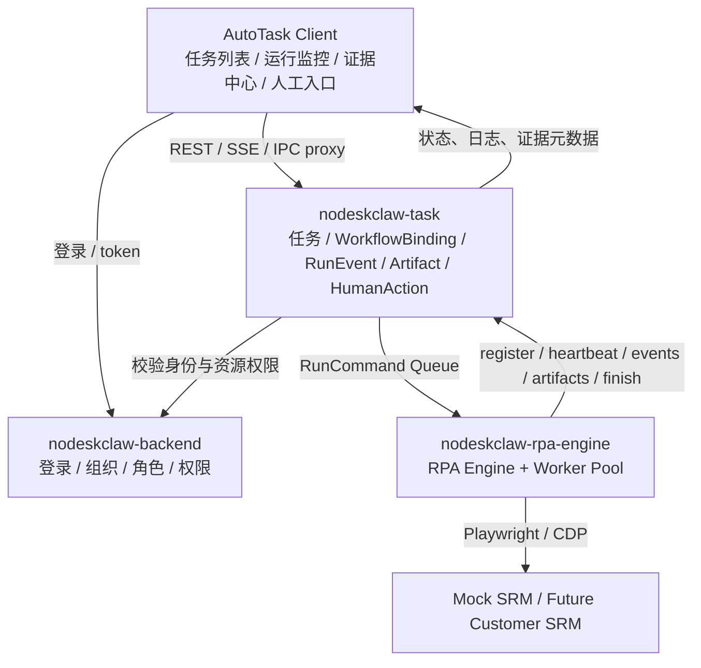
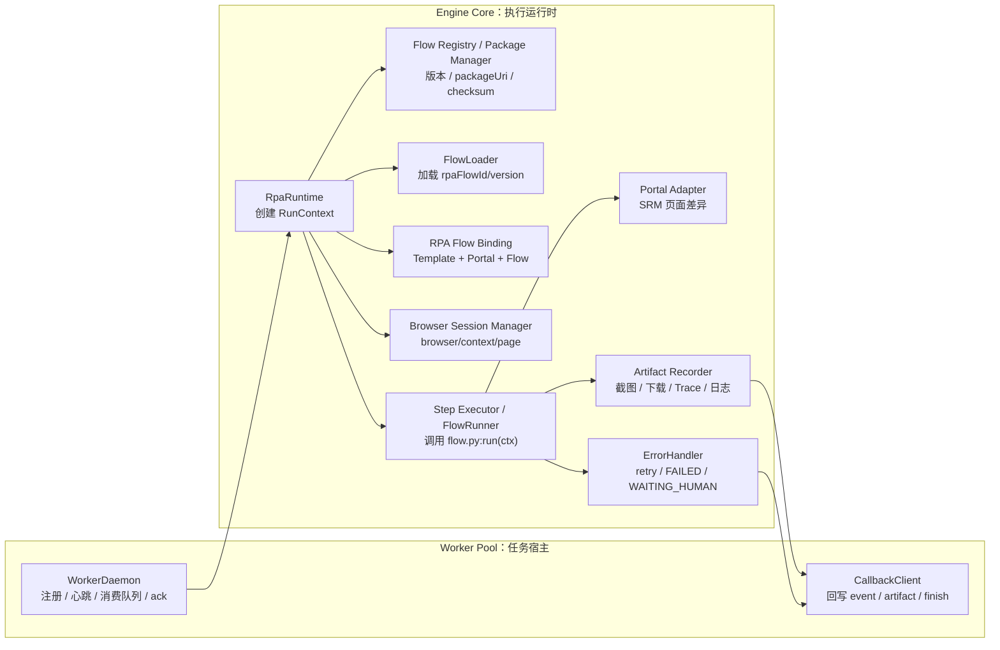
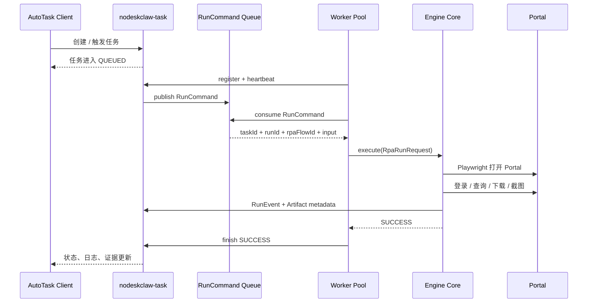
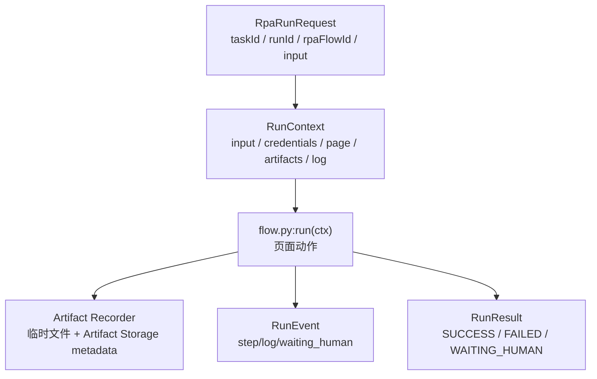
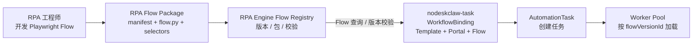

# AutoTask RPA Engine v0.6 PRD

## RPA Engine 生产导向设计方案

## 1. 版本信息

```text
版本：v0.6
类型：RPA Engine Production-Oriented Baseline
范围：nodeskclaw-rpa-engine + Queue + Worker Callback API + AutoTask 状态展示
优先级：P0
目标：以生产架构边界打通服务器无人值守 RPA 的第一条可验证闭环
```

本阶段重点不是做完整低代码 RPA 平台，而是在不牺牲后续生产架构的前提下，先验证：

```text
任务可被投递为 RunCommand 并被 RPA Engine 内置 Worker Pool 消费
RPA Engine 可启动 Playwright 执行浏览器自动化
执行过程可上报 RunEvent / StepRun / Artifact
执行结果可回写 SUCCESS / FAILED / WAITING_HUMAN
AutoTask 客户端可看到任务状态、运行日志和证据文件
```

## 2. 背景

AutoTask 当前已经完成桌面工作台、任务列表、流程模板、RPA 运行监控、证据中心、人工处理入口等 UI 原型，并在 v0.5 / v0.5.1 阶段开始从 mock 数据切换到 `nodeskclaw-task` 真实接口。

现有产品定位已经明确：

```text
AutoTask Client
= Electron + React 桌面工作台
= 任务操作台
= RPA 状态查看台
= 人工处理入口
= 不直接执行 Playwright RPA

nodeskclaw-task
= AutoTask 业务数据服务
= 任务调度
= WorkflowBinding / Run / Event / Artifact / HumanAction 管理
= Queue / Worker Callback API
= 业务数据库所有者

RPA Engine
= Playwright 执行器
= Worker Pool
= Flow Registry / Flow Package 管理
= RPA Flow Binding
= 浏览器 Profile 管理
= Step 执行
= 截图 / Trace / 下载文件生成
= 执行事件上报
```

因此 v0.6 的关键是新增一个独立 RPA Engine 服务，让 AutoTask 从“能看任务”进入“能跑任务”的阶段。

## 3. 核心结论

### 3.1 RPA Engine 独立成服务

RPA Engine 不放在 Electron Client 中，也不直接合并进 `nodeskclaw-task`。

建议新建平级项目：

```text
D:\nodeskclaw-rpa-engine
```

定位：

```text
nodeskclaw-rpa-engine
= Python Playwright RPA Engine Service
= 常驻进程
= 内置 Worker Pool
= 消费 RunCommand Queue
= 执行后通过 Worker Callback API 回写状态
```

这样可以保证：

```text
1. Electron Client 保持轻量，只做工作台和人工处理。
2. nodeskclaw-task 保持业务服务职责，不被浏览器自动化污染。
3. RPA Engine 后续可以同时支持服务器运行形态、本地 Local Host、MCP 调用。
4. Playwright 逻辑集中维护，不会出现多套执行器分叉。
```

### 3.2 第一版选择服务器运行形态

v0.6 优先做服务器无人值守运行形态，而不是本地 Local Host。

原因：

```text
1. 更接近未来无人值守生产形态。
2. 能验证 task -> worker -> run -> artifact -> status 的后端闭环。
3. 能让 AutoTask 当前 UI 变成真实任务状态看板。
4. Local Host 后续可以复用同一套 RPA Runtime。
```

### 3.3 第一条验证流程使用 Mock SRM

第一版不直接接真实客户 SRM。

第一条验证流程使用可控的 Mock SRM 页面验证：

```text
登录
查询 PO
截图留痕
下载合同 / 附件
上报 Artifact
异常时进入 WAITING_HUMAN
```

原因：

```text
1. 避免第一版被真实站点验证码、MFA、网络策略卡住。
2. 可稳定复现成功、失败、人工介入三种场景。
3. 便于写自动化测试和演示脚本。
4. 后续替换 Portal Adapter 即可接真实 SRM。
```

### 3.4 与 v1.0 架构基线对齐

v0.6 是 v1.0 架构中的 RPA Engine 接入阶段，必须遵守以下边界：

```text
1. 业务流程模板不等于 RPA 脚本。
2. RPA Engine 内置 Worker Pool 执行的是 WorkflowBinding 指向的 RPA Flow。
3. RPA Engine 不直接理解客户权限、组织权限和业务审批。
4. 权限、任务状态、RunEvent、Artifact Metadata 归 nodeskclaw-task。
5. Playwright/CDP 只在 RPA Engine 内部开放，不暴露给 Client。
6. WAITING_HUMAN 采用类型 A 人工介入，不恢复服务器 Playwright 原会话。
```

### 3.5 Playwright + CDP 浏览器会话基线

RPA Engine 的执行内核明确采用 `PLAYWRIGHT_CDP`。其中：

```text
Playwright：
  作为 Flow 的浏览器自动化 API，负责 page、locator、download、screenshot、trace 等能力。

CDP：
  作为 Chrome / Chromium 的底层连接和接管通道，由 Browser Session Manager 统一管理。
```

`PLAYWRIGHT_CDP` 不表示第一版必须接管外部 Chrome。它表示 RPA Engine 的浏览器会话层从第一版开始按可扩展模式设计：

```text
MANAGED：
  RPA Engine 自己启动 Playwright Chromium。
  v0.6 必做，适合服务器无人值守任务。

PERSISTENT_PROFILE：
  RPA Engine 使用受控 userDataDir 启动持久化 Profile。
  v0.7 目标，适合复用登录态、Cookie、企业 SSO。

CDP_ATTACH：
  RPA Engine 通过 CDP endpoint 接管已启动的 Chrome。
  v0.8+ 目标，适合 Local Host、人工登录后接管、企业浏览器环境。
```

v0.6 的边界是：实现 `MANAGED`，在 RunCommand、Worker capability、Browser Session Manager 中预留 `PERSISTENT_PROFILE` 和 `CDP_ATTACH`，但不交付外部 Chrome 接管和人工处理后恢复原会话。

### 3.6 成熟框架对标与采纳策略

RPA Engine 不是从零发明一套 RPA 平台，而是在成熟框架和产品的分层经验上，围绕 AutoTask 的 SRM 任务闭环做可控实现。

采纳原则：

```text
1. P0 不做框架拼盘，不同时引入多个重型运行平台。
2. 执行内核采用 Playwright/CDP，避免自研浏览器自动化能力。
3. Flow 管理、浏览器会话、可靠调度、Step 体验分别参考成熟方案。
4. 对外呈现 AutoTask 自己的 Flow Registry、RunCommand、Artifact、WAITING_HUMAN 业务闭环。
5. 成熟框架作为设计参照和后续替代路径，不作为 v0.6 运行时强依赖。
```

对标关系：

| 参考项目 / 框架 | 成熟能力 | AutoTask 采纳位置 | v0.6 采纳方式 |
| --- | --- | --- | --- |
| Playwright / CDP | 浏览器自动化、BrowserContext、Page、下载、截图、Trace、CDP 连接 | `PLAYWRIGHT_CDP`、Browser Session Manager、RPA Runtime | 直接作为唯一浏览器执行底座 |
| Robocorp / Sema4 Automation | Robot Package、任务运行、Control Room、运行记录、Worker 管理 | Flow Registry、Package Store、Release Audit、Worker Pool | 参考包管理和运行管理模型，自建最小 Flow Registry |
| Browserless / Browserbase | 托管浏览器、远程浏览器会话、并发、CDP / Playwright 连接 | Browser Session Manager、browserSession、Worker capability | 参考浏览器会话池模型，v0.6 先实现 MANAGED |
| Temporal | Workflow / Activity、可靠执行、重试、超时、幂等、Worker | RunCommand Queue、Worker Pool、Error Handler、Callback 幂等 | 参考可靠任务执行语义，v0.6 使用 Queue + Callback 落地 |
| Robot Framework Browser / TagUI | 关键字式自动化、低门槛 Step 写法 | Step Executor、Flow SDK、后续 DSL | v0.6 固定 `flow.py:run(ctx)`，后续参考关键字 DSL |
| OpenRPA / Ui.Vision | 运行监控、证据、人工介入、低代码流程体验 | AutoTask Client 运行监控、证据中心、HumanAction | 参考产品体验，不作为执行内核 |

v0.6 明确不引入：

```text
1. 不引入 Robocorp Control Room 作为运行平台。
2. 不引入 Browserless / Browserbase 作为浏览器池依赖。
3. 不引入 Temporal Server 作为调度依赖。
4. 不引入 Robot Framework / TagUI runtime 作为 Flow 执行依赖。
5. 不把 OpenRPA / Ui.Vision 作为 AutoTask 执行内核。
```

这样可以降低纯自研风险，同时避免首版被多平台集成成本拖慢。

参考资料：

```text
Playwright：            https://playwright.dev/python/docs/intro
Robocorp：              https://robocorp.com/docs
Browserless：           https://docs.browserless.io/
Browserbase：           https://docs.browserbase.com/
Temporal：              https://docs.temporal.io/
Robot Framework Browser：https://docs.robotframework.org/docs/different_libraries/browser
TagUI：                 https://tagui.readthedocs.io/en/latest/
```

调度方式上，v0.6 生产导向版本采用 Queue + Callback 作为主模型。队列负责投递和消费 `RunCommand`，Worker Callback API 负责注册、心跳、事件回调、Artifact 回调和 Run finish。

```text
nodeskclaw-task：
  创建任务、校验权限、创建 RpaRun、投递 RunCommand

Queue：
  保存待执行 RunCommand，提供 ack / retry / visibility timeout / dead letter

RPA Engine：
  由内置 Worker Pool 消费 RunCommand，执行 RPA Flow，通过 Callback API 回写 RunEvent / Artifact / finish
```

## 4. 本阶段目标

v0.6 需要交付一个可演示、可联调、可扩展，并符合生产架构边界的服务器 RPA Engine 首版。

### 4.1 产品目标

```text
1. 用户在 AutoTask 中创建或触发一条 RPA 任务。
2. nodeskclaw-task 将任务置为 QUEUED。
3. RPA Engine 内置 Worker Pool 从 Queue 消费 RunCommand。
4. RPA Engine 通过 Browser Session Manager 以 MANAGED 模式启动 Playwright Chromium 并执行 Mock SRM 流程。
5. RPA Engine 持续上报运行事件、步骤状态和产物。
6. 任务结束后回写 SUCCESS / FAILED / WAITING_HUMAN。
7. AutoTask 客户端展示真实运行状态、日志和证据文件。
```

### 4.2 技术目标

```text
1. 新建 Python RPA Engine 项目骨架。
2. 实现 Worker 注册、心跳、Queue 消费、事件回调、完成上报。
3. 实现 RPA Runtime、Browser Session Manager、Step Executor、Artifact Recorder。
4. 实现 Mock SRM 自动化流程。
5. 实现截图、下载文件、Trace 的中心化上传和元数据上报。
6. 实现 WAITING_HUMAN 事件上报。
7. 支持从 WorkflowBinding / rpaFlowId 进入执行流程。
8. 保持 RPA Engine 不直接访问 nodeskclaw-task 业务数据库；Flow Registry 元数据由 RPA Engine 自己管理。
```

## 5. 非目标

v0.6 不做以下内容：

```text
1. 不做完整低代码流程编排器。
2. 不做真实客户 SRM 的大规模适配。
3. 不做复杂 Worker 自动扩缩容和跨区域调度。
4. 不绑定具体队列产品，Redis Streams / RabbitMQ / 云队列均可作为实现。
5. 不做本地 Electron 启动 Playwright。
6. 不做 Server 浏览器会话与 Desktop WebContentsView 会话共享。
7. 不做 CDP_ATTACH 接管外部 Chrome。
8. 不做 PERSISTENT_PROFILE 登录态复用。
9. 不做企业级 HSM / mTLS 全套凭证体系，但 credentialRef 必须走受控凭证 API。
10. 不做验证码自动识别。
11. 不把 WorkflowTemplate.businessSteps 直接当作可执行 RPA 脚本。
```

## 6. 总体架构



```text
┌─────────────────────────────────────────────────────────────┐
│ AutoTask Client                                              │
│ Electron + React                                             │
│                                                             │
│ - 任务列表                                                   │
│ - 运行监控                                                   │
│ - 证据中心                                                   │
│ - WAITING_HUMAN 人工处理入口                                  │
└───────────────────────────┬─────────────────────────────────┘
                            │
                            │ HTTPS / IPC proxy
                            ▼
┌─────────────────────────────────────────────────────────────┐
│ nodeskclaw-task                                              │
│ AutoTask 业务数据服务                                         │
│                                                             │
│ - AutomationTask                                             │
│ - WorkflowTemplate                                           │
│ - RpaRun / StepRun / RunEvent                                │
│ - Artifact Metadata                                          │
│ - HumanAction                                                │
│ - RunCommand Queue                                           │
│ - WorkflowBinding / Flow 引用快照                             │
└───────────────────────────┬─────────────────────────────────┘
                            │
                            │ Queue + Worker Callback API
                            ▼
┌─────────────────────────────────────────────────────────────┐
│ nodeskclaw-rpa-engine                                        │
│ Python + Playwright RPA Engine Service                        │
│                                                             │
│ - Worker Pool                                                │
│ - Flow Registry / Package Manager                            │
│ - RPA Flow Binding                                           │
│ - Browser Session Manager                                    │
│ - Step Executor                                              │
│ - Portal Adapter                                             │
│ - Artifact Recorder                                          │
│ - Error Handler                                              │
└───────────────────────────┬─────────────────────────────────┘
                            │
                            │ Playwright
                            ▼
┌─────────────────────────────────────────────────────────────┐
│ Mock SRM / Future Customer SRM                               │
│                                                             │
│ - Login                                                      │
│ - PO Search                                                  │
│ - Download                                                   │
│ - Manual Action Simulation                                   │
└─────────────────────────────────────────────────────────────┘
```

职责边界：

```text
AutoTask Client：
  只展示和操作，不直接跑 RPA。

nodeskclaw-task：
  负责任务、状态、业务数据库、调度、权限、WorkflowBinding、RunEvent、Artifact 元数据。

nodeskclaw-rpa-engine：
  负责 Flow Registry、Flow Package 发布与校验、Worker Pool、Playwright 执行、浏览器上下文、步骤执行、Portal 适配、截图、Trace、下载文件、错误处理和事件上报。
```

Worker Pool 是 RPA Engine 的内部模块，不是独立于 Engine 的另一个系统。v0.6 中它们位于同一个项目和进程内，但代码职责分层：

后文 API 或状态模型中出现的 `Worker`，均指 RPA Engine 内部 Worker Pool 中的一个可注册执行实例，不指独立服务或独立项目。



## 7. 运行流程

### 7.1 成功流程



```text
1. AutoTask 创建任务
2. nodeskclaw-task 保存 AutomationTask，状态为 QUEUED
3. RPA Engine 内置 Worker Pool 注册并保持心跳
4. nodeskclaw-task 投递 RunCommand 到 Queue
5. Worker Pool 消费 RunCommand，获得 runId、workflow、input 信息
6. Browser Session Manager 以 MANAGED 模式启动 Playwright Chromium
7. Engine Core 执行 srm.login
8. Engine Core 执行 srm.search_po
9. Engine Core 执行 file.download
10. Engine Core 执行 evidence.screenshot
11. Engine Core 上报 Artifact 元数据
12. Worker Pool 调用 runs/{runId}/finish
13. nodeskclaw-task 将任务置为 SUCCESS
14. AutoTask 运行监控和证据中心展示结果
```

### 7.2 异常流程

```text
1. Step 执行失败
2. RpaRuntime 根据 retry 配置重试
3. 重试仍失败后根据 onError 处理
4. onError = fail 时，Run 结束为 FAILED
5. onError = wait_human 时，上报 waiting_human 事件
6. nodeskclaw-task 创建 HumanAction
7. 任务状态变为 WAITING_HUMAN
8. AutoTask 客户端出现人工处理入口
```

### 7.3 Worker 崩溃流程

```text
1. Worker 消费 RunCommand 后开始执行
2. Worker 崩溃后没有 ack / finish
3. Queue visibility timeout 到期或消费者断开
4. RunCommand 重新可见，或进入 retry / dead letter
5. nodeskclaw-task 将任务置为 WAITING_RETRY 或重新投递
6. 其他 Worker 可重新消费
```

## 8. Queue + Worker Callback API

v0.6 采用 Queue + Callback 作为主调度模型。

```text
Queue：
  负责 RunCommand 投递、消费、ack、retry、visibility timeout、dead letter。

Worker Callback API：
  负责 Worker 注册、心跳、RunEvent、Artifact metadata、Run finish。
```

### 8.1 Worker 注册

```http
POST /api/v1/autotask/worker-api/workers/register
```

请求：

```json
{
  "workerId": "server-worker-001",
  "workerType": "SERVER_WORKER",
  "deviceName": "rpa-server-001",
  "agentVersion": "0.6.0",
  "os": "Windows Server",
  "capabilities": [
    "PLAYWRIGHT_CDP",
    "BROWSER_SESSION_MANAGED",
    "CHROMIUM",
    "HEADFUL",
    "HEADLESS",
    "SCREENSHOT",
    "TRACE",
    "DOWNLOAD"
  ]
}
```

v0.6 Worker 必须至少具备 `PLAYWRIGHT_CDP` 与 `BROWSER_SESSION_MANAGED`。`BROWSER_SESSION_PERSISTENT_PROFILE` 和 `BROWSER_SESSION_CDP_ATTACH` 可作为后续 capability 扩展，不作为首版验收项。

### 8.2 Worker 心跳

```http
POST /api/v1/autotask/worker-api/workers/{workerId}/heartbeat
```

请求：

```json
{
  "status": "online",
  "currentTaskCount": 0,
  "browserCount": 0,
  "cpuUsage": "12%",
  "memoryUsage": "512MB"
}
```

### 8.3 RunCommand Queue

`nodeskclaw-task` 校验任务、权限、PortalAccount、WorkflowBinding 后，向 RPA Engine Flow Registry 解析绑定的 Flow 版本快照，再向队列投递 `RunCommand`。

RunCommand payload：

```json
{
  "commandId": "cmd_001",
  "taskId": "task_001",
  "runId": "run_001",
  "workflowTemplateId": "wf_srm_fetch_po",
  "workflowCode": "srm_fetch_po",
  "workflowBindingId": "wfb_mock_srm_fetch_po",
  "rpaEngineType": "PLAYWRIGHT_CDP",
  "rpaFlowId": "rpa_flow_mock_srm_fetch_po",
  "rpaFlowVersion": "0.6.0",
  "rpaFlowVersionId": "rfv_mock_srm_fetch_po_0_6_0",
  "packageUri": "https://rpa-engine.internal/flow-packages/rpa_flow_mock_srm_fetch_po/0.6.0/package.zip",
  "packageChecksum": "sha256:...",
  "portalAccountId": "portal_mock_srm",
  "credentialRef": "mock_srm_default",
  "input": {
    "po_no": "PO-20260708-001"
  },
  "options": {
    "browserSession": {
      "mode": "MANAGED",
      "headless": false,
      "channel": "chromium",
      "profileRef": null,
      "cdpEndpointRef": null,
      "closePolicy": "CLOSE_ON_FINISH"
    },
    "saveScreenshot": true,
    "enableTrace": true,
    "retryTimes": 1,
    "timeoutSeconds": 120
  },
  "steps": [
    {
      "id": "step_login",
      "name": "登录 Mock SRM",
      "type": "srm.login",
      "timeout": 60,
      "retry": 1,
      "onError": "wait_human"
    },
    {
      "id": "step_search_po",
      "name": "搜索采购订单",
      "type": "srm.search_po",
      "input": {
        "po_no": "{{task.input.po_no}}"
      },
      "timeout": 30,
      "retry": 2,
      "onError": "fail"
    },
    {
      "id": "step_download_contract",
      "name": "下载采购合同",
      "type": "file.download",
      "timeout": 60,
      "retry": 1,
      "onError": "wait_human"
    },
    {
      "id": "step_save_evidence",
      "name": "保存截图证据",
      "type": "evidence.screenshot",
      "timeout": 10,
      "retry": 0,
      "onError": "ignore"
    }
  ]
}
```

`packageUri` 和 `packageChecksum` 来源于 RPA Engine Flow Registry。`nodeskclaw-task` 可以在 RunCommand 中保存它们作为运行快照，但不作为 Flow Registry 的权威数据源。

`browserSession` 由 `nodeskclaw-task` 根据 WorkflowBinding、PortalAccount 和 Worker capability 生成运行快照。v0.6 固定使用 `mode = MANAGED`；`profileRef` 与 `cdpEndpointRef` 仅为后续版本预留，不允许 Flow 直接读取或使用。

浏览器会话模式：

```text
MANAGED：
  RPA Engine 自己启动 Playwright Chromium，运行结束后关闭。

PERSISTENT_PROFILE：
  RPA Engine 使用受控 BrowserProfile 启动持久化 userDataDir。
  v0.6 只预留字段，不执行。

CDP_ATTACH：
  RPA Engine 连接受控 cdpEndpointRef 对应的 Chrome。
  v0.6 只预留字段，不执行。
```

队列语义：

```text
1. Worker 消费 RunCommand 后，任务进入 RUNNING。
2. Worker 执行成功后 ack，并调用 finish。
3. Worker 执行失败但可重试时 nack / retry。
4. Worker 崩溃或超时未 ack 时，消息在 visibility timeout 后重新可见。
5. 超过最大重试次数后进入 dead letter，nodeskclaw-task 将任务置为 FAILED 或 WAITING_RETRY。
```

### 8.4 上报事件

```http
POST /api/v1/autotask/worker-api/runs/{runId}/events
```

事件类型：

```text
run_started
step_started
step_succeeded
step_failed
step_retrying
artifact_saved
screenshot_saved
download_saved
waiting_human
run_finished
log
```

请求：

```json
{
  "eventType": "step_succeeded",
  "stepId": "step_search_po",
  "stepName": "搜索采购订单",
  "level": "INFO",
  "message": "PO 查询成功",
  "payload": {
    "po_no": "PO-20260708-001"
  },
  "createdAt": "2026-07-08T10:20:00Z"
}
```

### 8.5 上报 Artifact

```http
POST /api/v1/autotask/worker-api/runs/{runId}/artifacts
```

请求：

```json
{
  "taskId": "task_001",
  "runId": "run_001",
  "name": "PO-20260708-001-contract.pdf",
  "type": "download",
  "storageKey": "artifacts/task_001/run_001/downloads/contract.pdf",
  "objectKey": "artifacts/task_001/run_001/downloads/contract.pdf",
  "mimeType": "application/pdf",
  "sizeBytes": 204800,
  "checksum": "sha256:...",
  "metadata": {
    "stepId": "step_download_contract",
    "source": "mock_srm"
  }
}
```

### 8.6 完成 Run

```http
POST /api/v1/autotask/worker-api/runs/{runId}/finish
```

成功：

```json
{
  "taskId": "task_001",
  "workerId": "server-worker-001",
  "commandId": "cmd_001",
  "status": "SUCCESS",
  "message": "RPA run completed",
  "endedAt": "2026-07-08T10:25:00Z"
}
```

等待人工：

```json
{
  "taskId": "task_001",
  "workerId": "server-worker-001",
  "commandId": "cmd_001",
  "status": "WAITING_HUMAN",
  "message": "Mock SRM requires manual verification",
  "humanAction": {
    "type": "manual_captcha",
    "targetUrl": "http://127.0.0.1:4600/mock-srm/manual/task_001",
    "instruction": "请完成验证码或人工确认后在 AutoTask 中点击确认"
  },
  "endedAt": "2026-07-08T10:25:00Z"
}
```

说明：

```text
WAITING_HUMAN 只表示服务器自动化暂停并交给人工处理。
用户确认完成后，任务进入 SUCCESS_MANUAL 或后续人工状态。
v0.6 不恢复原服务器 Playwright 浏览器上下文，也不继续执行原 Run。
```

## 9. RPA Engine 内部设计

### 9.1 建议项目结构

```text
nodeskclaw-rpa-engine/
├─ app/
│  ├─ main.py
│  ├─ config.py
│  ├─ worker_pool/
│  │  ├─ worker_daemon.py
│  │  ├─ queue_consumer.py
│  │  └─ heartbeat.py
│  ├─ clients/
│  │  └─ callback_client.py
│  ├─ flow_registry/
│  │  ├─ registry_service.py
│  │  ├─ package_store.py
│  │  ├─ manifest_validator.py
│  │  └─ release_audit.py
│  ├─ runtime/
│  │  ├─ rpa_runtime.py
│  │  ├─ run_context.py
│  │  ├─ flow_loader.py
│  │  ├─ flow_runner.py
│  │  └─ errors.py
│  ├─ browser_session/
│  │  ├─ browser_session_manager.py
│  │  ├─ managed_browser.py
│  │  ├─ profile_manager.py
│  │  ├─ cdp_connector.py
│  │  └─ browser_profile_store.py
│  ├─ step_executor/
│  │  ├─ step_registry.py
│  │  ├─ browser_steps.py
│  │  ├─ page_steps.py
│  │  ├─ file_steps.py
│  │  └─ evidence_steps.py
│  ├─ portal_adapters/
│  │  └─ mock_srm/
│  │     ├─ adapter.py
│  │     └─ selectors.py
│  ├─ artifacts/
│  │  └─ artifact_recorder.py
│  ├─ errors/
│  │  └─ error_handler.py
│  └─ mock_srm/
│     └─ server.py
├─ tests/
├─ storage/
│  ├─ artifacts/
│  ├─ browser-profiles/
│  └─ traces/
├─ pyproject.toml
├─ README.md
└─ .env.example
```

### 9.2 技术选型

```text
语言：Python 3.12
浏览器自动化：Playwright
服务框架：FastAPI
配置：pydantic-settings
HTTP Client：httpx
Flow Registry 元数据：SQLite 开发环境 / PostgreSQL 生产环境
重试：tenacity
日志：loguru
测试：pytest + pytest-asyncio
```

### 9.3 核心模块职责

```text
WorkerDaemon：
  Worker Pool 内部常驻组件，注册 Worker 实例，发送心跳，消费 RunCommand Queue，处理 ack / nack。

CallbackClient：
  封装 nodeskclaw-task Worker Callback API，回写 RunEvent / Artifact / finish。

FlowRegistry：
  管理 RPA Flow 元数据、版本、manifest、packageUri、checksum、发布状态和发布审计。

PackageStore：
  封装 MinIO / S3 / 制品仓库，保存 RPA Flow Package 文件并生成下载地址。

RpaRuntime：
  接收 RunCommand，解析 WorkflowBinding，创建 RunContext，执行 FlowRunner。

FlowLoader：
  根据 rpaFlowId / version / checksum 从 Flow Registry 拉取并校验 RPA Flow Package。

FlowRunner / Step Executor：
  按步骤顺序执行 Step，处理 timeout、retry、onError。

StepRegistry：
  Step Executor 内部注册表，将 step.type 映射到具体执行函数。

Browser Session Manager：
  按 browserSession.mode 创建浏览器会话。v0.6 必须实现 MANAGED，预留 PERSISTENT_PROFILE 和 CDP_ATTACH。
  统一创建 BrowserContext / Page，管理下载目录、trace、close / detach 策略。

ProfileManager：
  按 portalAccountId / profileRef 隔离浏览器 profile。v0.6 只定义 BrowserProfile 模型和存储路径，不复用登录态。

CdpConnector：
  封装 Playwright connect_over_cdp。v0.6 只保留接口和安全约束，不连接外部 Chrome。

Artifact Recorder：
  保存截图、Trace、下载文件，生成 artifact metadata 并上报。

Portal Adapter / Mock SRM Adapter：
  封装 Mock SRM 的登录、查询、下载、异常判断；真实 SRM 后续以同一接口扩展。
```

### 9.4 Browser Session Model

Browser Session Manager 是 `PLAYWRIGHT_CDP` 方案的核心模块。Flow 不能自己启动 browser、读取 profile 路径或连接 CDP endpoint，只能使用 Runtime 注入的 `ctx.page`。

```text
BrowserSession：
  mode              MANAGED / PERSISTENT_PROFILE / CDP_ATTACH
  headless          是否无头运行
  channel           chromium / chrome / msedge
  profileRef        受控 BrowserProfile 引用
  cdpEndpointRef    受控 CDP endpoint 引用
  closePolicy       CLOSE_ON_FINISH / DETACH_ON_FINISH
```

v0.6 实现范围：

```text
1. 支持 MANAGED。
2. Browser Session Manager 自己启动 Playwright Chromium。
3. 每个 Run 创建独立 BrowserContext / Page。
4. 支持 headless / headful。
5. 支持 download 目录和 trace 管理。
6. Run 结束后按 CLOSE_ON_FINISH 关闭会话。
7. 定义 BrowserProfile / CdpEndpointRef 数据结构，但不启用。
```

后续版本扩展：

```text
PERSISTENT_PROFILE：
  使用 BrowserProfile.userDataDir 启动持久化浏览器，实现登录态复用。

CDP_ATTACH：
  使用 Playwright connect_over_cdp 连接受控 Chrome，用于 Local Host、人工登录后接管或企业浏览器环境。
```

BrowserProfile 建议字段：

```text
profileRef
portalAccountId
ownerType
storagePath
allowedWorkerTags
status
lastUsedAt
```

## 10. RPA Flow 开发规范与 Step DSL v0.6

### 10.1 平台化结论

传统 Playwright 脚本通常是自启动、自执行、自退出：

```text
启动脚本
启动 Playwright / Browser
创建 page
执行 fill / click / wait / download / screenshot
保存文件
关闭浏览器
脚本退出
```

这种方式可以完成自动化，但不适合 AutoTask 平台化，因为它缺少：

```text
taskId / runId
RunEvent / StepRun
Artifact Metadata
统一 retry
统一 WAITING_HUMAN
统一凭证解析
统一浏览器 Profile
任务状态回写
Client 可见的运行记录
```

因此 v0.6 的 RPA Flow 必须被 RPA Runtime 接管：



```text
Worker Pool / WorkerDaemon 消费 RunCommand
RpaRuntime 创建 RunContext
Browser Session Manager 创建 browser / context / page
FlowLoader 加载 RPA Flow Package
Step Executor / FlowRunner 调用 flow.py:run(ctx)
Artifact Recorder 接管截图、下载、Trace、日志
ErrorHandler 映射 retry / FAILED / WAITING_HUMAN
CallbackClient 回写 RunEvent / Artifact / finish
```

v0.6 生产基线采用 **Python function entrypoint**，前提是 Flow 由内部 RPA 工程师开发，并经过发布校验、checksum 校验和权限审计：

```text
采用：
  RPA Engine import flow.py
  调用 async def run(ctx)

不用于内部可信 Flow 的默认路径：
  RPA Engine 启动 python 子进程执行脚本
```

选择原因：

```text
1. 内部 RPA 工程师开发，脚本可信度可控。
2. 可直接注入 page、input、credential、artifact recorder。
3. 开发和调试成本低，适合第一阶段快速验证。
4. 如果开放外部不可信脚本，必须改用子进程、容器或沙箱隔离。
```

### 10.2 RPA Flow Package 结构

RPA 工程师交付的不是单个 `.py` 文件，而是版本化的 RPA Flow Package。

建议结构：

```text
rpa_flows/
  rpa_flow_mock_srm_fetch_po/
    0.6.0/
      manifest.json
      flow.py
      selectors.json
      tests/
```

`manifest.json` 示例：

```json
{
  "rpaFlowId": "rpa_flow_mock_srm_fetch_po",
  "name": "Mock SRM 获取采购订单",
  "version": "0.6.0",
  "engineType": "PLAYWRIGHT_CDP",
  "entrypoint": "flow.py:run",
  "supportedWorkflowCodes": ["srm_fetch_po"],
  "supportedPortalTypes": ["CUSTOMER_SRM"],
  "inputSchema": [
    { "name": "po_no", "type": "string", "required": true }
  ],
  "capabilities": ["screenshot", "download", "trace"]
}
```

导入与绑定流程：



```text
1. RPA 工程师开发并测试 Playwright Flow。
2. 打包为 RPA Flow Package。
3. 发布到 RPA Engine 的 Flow Registry。
4. RPA Engine 保存 Flow 元数据、manifest、checksum、packageUri 和发布审计。
5. Client 管理界面选择 WorkflowTemplate + PortalAccount + RPA Flow。
6. nodeskclaw-task 调用 RPA Engine Flow API 校验版本可绑定，并创建 WorkflowBinding。
7. WorkflowBinding 保存 rpaFlowId / rpaFlowVersion / rpaFlowVersionId / checksumSnapshot。
8. 创建任务时，nodeskclaw-task 根据 WorkflowBinding 下发 Flow 版本快照。
9. Worker Pool 根据 flowVersionId 或 rpaFlowId / rpaFlowVersion 加载并执行 Flow。
```

Flow Registry 是 RPA Engine 内部的中心化 Flow 管理模块，负责保存可查询、可绑定、可审计的 Flow 元数据，并管理版本化脚本包的 `packageUri`、checksum、manifest 和发布状态。`nodeskclaw-task` 只保存 WorkflowBinding 与运行快照，不读取 Worker 本机脚本文件，Worker 本地目录只作为执行缓存。

Flow 管理入口采用“Client 页面 + RPA Engine API”的方式：AutoTask Client 提供 Flow 列表、版本、发布、禁用、回滚、测试运行等页面；真正的 Flow 管理 API 属于 RPA Engine；`nodeskclaw-task` 在创建 WorkflowBinding 时调用 RPA Engine 校验 Flow 版本，并保存绑定快照。

生产导向结构：

```text
rpa-engine-flow-registry/
  rpa_flow_mock_srm_fetch_po/
    0.6.0/
      rpa_flow_mock_srm_fetch_po-0.6.0.zip
      manifest.json
      package.meta.json
      checksum.sha256
```

发布一个 Flow 的工程步骤：

```text
1. RPA 工程师本地完成开发和 Mock Portal 测试。
2. 执行 manifest、entrypoint、selector、禁止项校验。
3. 将包提交给 RPA Engine Flow Registry。
4. 生成 checksum、packageUri 和 package.meta.json。
5. RPA Engine Flow Registry 保存 Flow 元数据和发布审计。
6. Flow 状态变为 PUBLISHED 后，nodeskclaw-task 才能创建 WorkflowBinding。
7. Worker Pool 执行实例按 flowVersionId 解析 packageUri，拉取、校验、缓存并加载包。
```

版本规则：

```text
1. rpaFlowId + version 不允许覆盖发布。
2. WorkflowBinding 绑定具体版本，不自动漂移到 latest。
3. 回滚通过切换 WorkflowBinding 的 rpaFlowVersion 完成。
4. Worker 本地缓存不是权威数据源，可删除后按 packageUri 重新拉取。
```

### 10.3 入口规范

入口规范使用 `flow.py:run`：

```text
flow.py
  文件名

run
  标准入口函数名
```

RPA Flow 必须暴露：

```python
async def run(ctx):
    ...
```

示例：

```python
async def run(ctx):
    page = ctx.page
    po_no = ctx.input["po_no"]

    await page.goto(ctx.portal_url)
    await page.fill(ctx.selectors["po_input"], po_no)
    await page.click(ctx.selectors["search_button"])

    await ctx.artifacts.screenshot("po_search_result")
```

脚本入口只负责页面动作，不负责：

```text
启动 browser
创建 context
连接数据库
读取明文密码文件
调用 nodeskclaw-task 写状态
自行保存 Artifact 元数据
自行结束 task / run
```

### 10.4 RunContext 注入对象

RPA Runtime 调用 `run(ctx)` 时注入统一上下文。

```text
ctx.input
  任务输入，例如 po_no、delivery_no、invoice_no。

ctx.credentials
  由 credentialRef 临时解析的凭证，只在 Worker 内存中使用。

ctx.page
  Browser Session Manager 创建好的 Playwright Page。

ctx.portal_url
  当前 Portal 入口地址。

ctx.selectors
  当前 Flow 的 selectors.json。

ctx.artifacts
  Artifact Recorder，用于保存截图、下载、Trace、日志。

ctx.log
  运行日志接口，写入 RunEvent。

ctx.events
  事件上报接口，例如 step_started、step_succeeded、waiting_human。

ctx.config
  WorkflowBinding 或 RPA Flow 的运行配置，例如 timeout、retry、headless。
```

### 10.5 RPA 工程师开发规则

必须遵守：

```text
1. 每个脚本必须发布成 RPA Flow Package。
2. 每个包必须有 manifest.json。
3. 每个包必须暴露 async def run(ctx)。
4. 脚本不能自己启动 browser。
5. 脚本不能自己连接数据库。
6. 脚本不能直接调用 nodeskclaw-task 写状态。
7. 脚本不能读取明文密码文件。
8. 截图、下载、Trace 必须通过 ctx.artifacts。
9. 日志、步骤状态、异常必须通过标准接口或标准异常交给 Runtime。
10. 输入参数只能从 ctx.input 取。
```

建议遵守：

```text
1. selector 放 selectors.json，不散落在代码里。
2. 每个 Flow 自带 tests。
3. 每个异常映射成标准错误码。
4. 客户差异放 Adapter，不写死在通用 Flow 里。
5. 版本号按 semver 管理，例如 1.0.0、1.0.1。
```

禁止：

```text
1. hardcode 账号密码。
2. 直接写业务数据库。
3. 私自上传文件到未知地址。
4. 吞掉异常但不上报。
5. 绕过 Artifact Recorder 保存证据。
```

### 10.6 异常与状态映射

RPA Flow 预期异常分为三类。

技术异常：

```text
页面超时
元素找不到
点击失败
下载超时
浏览器崩溃
网络错误
文件保存失败
```

业务异常：

```text
登录失败
账号无权限
PO 不存在
Portal 返回业务校验失败
重复提交
客户系统维护中
```

人工介入异常：

```text
验证码
MFA
短信验证
需要人工确认
页面状态无法判断
需要人工上传文件
```

标准异常建议：

```text
RpaRetryableError
  可重试错误。

RpaBusinessError
  明确业务失败。

RpaHumanRequiredError
  需要人工介入。

RpaFatalError
  致命失败。
```

映射规则：

```text
Timeout / 网络抖动 / 下载偶发失败
  -> retry

PO 不存在 / 参数错误 / 权限不足
  -> FAILED

验证码 / MFA / 需要人工确认
  -> WAITING_HUMAN

浏览器崩溃 / Worker 退出
  -> Queue visibility timeout 后重试，或进入 WAITING_RETRY / dead letter
```

`onError` 支持：

```text
fail：任务失败
retry：继续重试
wait_human：转人工处理
ignore：忽略错误并继续
```

Runtime 先按异常类型判断，再结合 Step 配置中的 `retry` 和 `onError` 生成最终状态。

### 10.7 Artifact Recorder 规范

截图、下载、Trace、日志必须统一交给 Artifact Recorder。

脚本示例：

```python
await ctx.artifacts.screenshot("po_search_result")

async with ctx.page.expect_download() as download_info:
    await ctx.page.click(ctx.selectors["download_contract"])

download = await download_info.value
await ctx.artifacts.save_download(download, "contract.pdf")
```

通信策略：

```text
RunEvent：
  小 JSON，按关键事件上报。

Artifact metadata：
  小 JSON，记录 name、type、storageKey、size、mimeType、stepId。

截图 / 下载文件 / Trace：
  Worker 写入临时目录后上传中心化 Artifact Storage，不通过 nodeskclaw-task API 传输大文件。
```

生产导向存储：

```text
Worker 向 nodeskclaw-task 申请 upload-url
Worker 直接上传 MinIO / S3
nodeskclaw-task 只保存 object key 和 download-url
Client 通过短时 download-url 下载
Worker 临时目录只用于运行过程缓存，任务结束后可清理
```

通信压力控制：

```text
1. 不每次 click 都截图。
2. 只在关键步骤、失败、人工介入前截图。
3. Trace 默认只在失败或调试模式开启。
4. 高频日志写入 Worker 临时日志文件，关键日志上报 RunEvent。
5. Artifact 大文件不走业务 API。
```

### 10.8 Step DSL v0.6

Step DSL 来自 `WorkflowBinding` 指向的 `RPA Flow`，不是业务用户维护的 `WorkflowTemplate.businessSteps`。业务模板用于展示和建任务；RPA Flow 用于执行。

v0.6 只支持最小步骤集合：

```text
srm.login
srm.search_po
file.download
file.upload
evidence.screenshot
page.click
page.fill
page.wait_for_selector
```

统一 Step 结构：

```json
{
  "id": "step_search_po",
  "name": "搜索采购订单",
  "type": "srm.search_po",
  "input": {
    "po_no": "{{task.input.po_no}}"
  },
  "timeout": 30,
  "retry": 2,
  "onError": "fail"
}
```

## 11. 状态模型

### 11.1 AutomationTask 状态

v0.6 至少需要支持：

```text
QUEUED
RUNNING
WAITING_HUMAN
WAITING_RETRY
SUCCESS
FAILED
CANCELLED
```

### 11.2 StepRun 状态

```text
PENDING
RUNNING
SUCCESS
FAILED
WAITING_HUMAN
```

### 11.3 Worker 状态

```text
online
busy
offline
```

## 12. Artifact 设计

v0.6 从第一版开始按中心化 Artifact Storage 设计，数据库只保存元数据，Worker 本地只保留运行期临时文件。

Worker 临时目录：

```text
runtime-cache/artifacts/{taskId}/{runId}/
├─ screenshots/
├─ downloads/
├─ traces/
└─ logs/
```

Artifact 类型：

```text
screenshot
download
upload
trace
dom_snapshot
log
```

中心化存储：

```text
Worker：
  生成截图 / 下载 / Trace / 日志
  写入临时目录
  申请 upload-url
  上传到 Artifact Storage

Artifact Storage：
  MinIO / S3 / 企业对象存储
  保存真实文件

nodeskclaw-task：
  保存 Artifact metadata
  保存 storageKey / objectKey / checksum / size / mimeType
  签发短时 download-url
```

## 13. 安全策略

v0.6 首版采用生产基础安全模型：

```text
1. Worker 使用服务账号身份，不使用用户主 token。
2. Worker 通过 clientId / clientSecret 或受管密钥换取短时 Worker JWT。
3. Worker 不接收用户主 token。
4. Worker 不直接访问 nodeskclaw-task 业务数据库。
5. Mock SRM 凭证仅用于演示。
6. credentialRef 只作为凭证引用，不在前端显示明文密码。
7. 真实凭证必须通过 nodeskclaw-task 或凭证服务的受控 API 临时获取。
8. 使用凭证触发 RPA 必须由 nodeskclaw-task 完成权限校验和审计。
9. Artifact 访问使用短时 upload-url / download-url。
10. 生产环境推荐启用 Worker 证书或 mTLS。
11. Flow 不能直接读取 profileRef、cdpEndpointRef 或 userDataDir。
12. Flow 不能直接调用 connect_over_cdp 或自行启动 Chrome。
13. CDP endpoint 只能由 Browser Session Manager 解析和连接。
14. CDP endpoint 生产环境必须绑定 127.0.0.1 或受控内网地址，并通过服务身份校验。
15. BrowserProfile 必须按 portalAccountId / Worker capability 做权限隔离。
```

## 14. 配置项

`.env.example` 建议：

```env
APP_NAME=nodeskclaw-rpa-engine
APP_ENV=development

WORKER_ID=server-worker-001
WORKER_TYPE=SERVER_WORKER
WORKER_CLIENT_ID=server-worker-001
WORKER_CLIENT_SECRET=change-me-via-secret-manager

TASK_API_BASE_URL=http://127.0.0.1:4520/api/v1/autotask
RUN_COMMAND_QUEUE_URL=redis://127.0.0.1:6379/0
RPA_ENGINE_PUBLIC_BASE_URL=http://127.0.0.1:4610
FLOW_REGISTRY_DB_URL=sqlite:///./storage/flow-registry.db
FLOW_PACKAGE_BUCKET=rpa-flow-packages
ARTIFACT_STORAGE_ENDPOINT=http://127.0.0.1:9000

BROWSER_SESSION_MODE=MANAGED
BROWSER_HEADLESS=false
BROWSER_CHANNEL=chromium
ENABLE_CDP_ATTACH=false
ENABLE_PERSISTENT_PROFILE=false

STORAGE_DIR=./storage
ARTIFACT_DIR=./storage/artifacts
BROWSER_PROFILE_DIR=./storage/browser-profiles
CDP_ENDPOINT_SECRET_KEY=change-me-via-secret-manager
TRACE_DIR=./storage/traces

LEASE_POLL_INTERVAL_SECONDS=5
LEASE_RENEW_INTERVAL_SECONDS=20
MAX_CONCURRENT_RUNS=1

MOCK_SRM_ENABLED=true
MOCK_SRM_BASE_URL=http://127.0.0.1:4600
MOCK_SRM_USERNAME=demo
MOCK_SRM_PASSWORD=demo123
```

## 15. Mock SRM 演示场景

### 15.1 成功场景

```text
输入 PO：PO-20260708-001
结果：查询成功，下载合同，保存截图，任务 SUCCESS
```

### 15.2 查无结果

```text
输入 PO：PO-NOT-FOUND
结果：上报 BUSINESS_NOT_FOUND，任务 FAILED
```

### 15.3 需要人工

```text
输入 PO：PO-MANUAL-001
结果：触发 CAPTCHA/MFA 模拟，任务 WAITING_HUMAN
```

### 15.4 下载失败

```text
输入 PO：PO-DOWNLOAD-FAIL
结果：file.download 重试后失败，根据 onError 转 WAITING_HUMAN
```

## 16. 里程碑

### Phase 1：RPA Engine 项目骨架

```text
1. 新建 nodeskclaw-rpa-engine。
2. 完成配置、日志、启动入口。
3. 完成 Worker Pool 注册和心跳。
4. 完成 Queue / Callback API 集成测试。
```

交付物：

```text
RPA Engine 服务可启动
Worker Pool 可打印心跳
RPA Engine 可连接 nodeskclaw-task health
```

### Phase 2：Queue 调度与 Run 上报

```text
1. 实现 RunCommand Queue 发布与消费。
2. 实现 ack / retry / visibility timeout / dead letter。
3. 实现 runs/{runId}/events。
4. 实现 runs/{runId}/artifacts。
5. 实现 runs/{runId}/finish。
```

交付物：

```text
QUEUED 任务可被投递为 RunCommand
Worker Pool 可消费 RunCommand
任务可变为 RUNNING
RunEvent 可在 nodeskclaw-task 查询
```

### Phase 3：Playwright Runtime

```text
1. 实现 Browser Session Manager 的 MANAGED 模式。
2. 支持 browserSession 运行快照。
3. 实现 Step Executor / StepRegistry。
4. 支持 srm.login / srm.search_po / file.download / evidence.screenshot。
5. 实现截图和下载文件上传 Artifact Storage。
```

交付物：

```text
Mock SRM 成功流程可跑通
MANAGED 浏览器会话可启动和关闭
生成 screenshot / download / trace
```

### Phase 4：WAITING_HUMAN 闭环

```text
1. 实现 CAPTCHA/MFA 模拟。
2. Worker Pool 上报 waiting_human event。
3. nodeskclaw-task 创建 HumanAction。
4. AutoTask 展示人工处理入口。
```

交付物：

```text
WAITING_HUMAN 任务可在 AutoTask 中看到
用户可打开人工处理入口
```

## 17. 验收标准

v0.6 完成时，必须满足：

```text
1. RPA Engine 服务可独立启动。
2. Worker Pool 可注册为 online。
3. Worker Pool 可定时发送 heartbeat。
4. Worker Pool 可消费 RunCommand。
5. RunCommand 消费后任务变为 RUNNING。
6. RPA Engine 可按 browserSession.mode = MANAGED 启动 Playwright Chromium。
7. RPA Engine 可完成 Mock SRM 登录和 PO 查询。
8. RPA Engine 可上传截图到 Artifact Storage。
9. RPA Engine 可上传下载文件到 Artifact Storage。
10. RPA Engine 可上报 Artifact metadata。
11. RPA Engine 可上报 RunEvent。
12. 成功流程任务变为 SUCCESS。
13. 失败流程任务变为 FAILED。
14. 人工流程任务变为 WAITING_HUMAN。
15. AutoTask 任务列表能看到状态变化。
16. AutoTask 运行监控能看到日志和步骤状态。
17. AutoTask 证据中心能看到截图和下载文件。
18. Flow 不能直接启动浏览器、读取 profileRef、读取 cdpEndpointRef 或调用 connect_over_cdp。
19. Worker 不直接访问 nodeskclaw-task 业务数据库。
20. Worker 崩溃后 RunCommand 可因 visibility timeout 重新投递或进入 dead letter。
21. 所有首版流程有自动化测试或可重复演示脚本。
```

## 18. 风险与应对

### 18.1 Queue / Callback API 未完成

风险：

```text
Worker 无法真实消费 RunCommand 或回写运行状态。
```

应对：

```text
1. 先定义 RunCommand payload、Callback API 和队列语义。
2. 用集成测试队列跑通 RPA Runtime。
3. 同步推动 nodeskclaw-task 补齐 Queue 发布、Callback API、Run 状态流转。
```

### 18.2 Playwright 环境依赖

风险：

```text
服务器未安装 Python / Playwright 浏览器依赖。
```

应对：

```text
提供 bootstrap 脚本和 README。
明确 Python 3.12、playwright install chromium 为前置条件。
```

### 18.3 真实 SRM 差异大

风险：

```text
真实客户 SRM 页面、登录方式、验证码策略差异大。
```

应对：

```text
v0.6 只跑 Mock SRM。
真实 SRM 从 v0.7 开始按 Portal Adapter 分客户接入。
```

### 18.4 Artifact Storage 前置依赖

风险：

```text
中心化 Artifact Storage 未部署时，Worker 无法完成生产级证据上传。
```

应对：

```text
1. 开发环境可用本地 MinIO 或共享对象存储模拟生产。
2. Artifact Recorder 从第一版就按 upload-url / storageKey 抽象实现。
3. Worker 临时目录只作为缓存，不作为权威存储。
4. nodeskclaw-task 只保存 metadata，不保存大文件。
```

### 18.5 纯自研踩坑风险

风险：

```text
如果 RPA Engine 被理解为完全从零自研，容易在 Flow 管理、浏览器会话、可靠调度、运行监控等成熟问题上重复踩坑。
```

应对：

```text
1. 将成熟框架能力映射写入架构基线。
2. Flow 管理参考 Robocorp / Sema4 Automation 的包、版本、发布、运行记录模型。
3. 浏览器会话参考 Browserless / Browserbase 的 session、capability、CDP 连接模型。
4. 可靠调度参考 Temporal 的 Workflow / Activity、retry、timeout、dead letter 和幂等思想。
5. Step 写法参考 Robot Framework Browser / TagUI 的关键字抽象，但 v0.6 不引入其 runtime。
```

### 18.6 成熟框架集成过重风险

风险：

```text
如果 v0.6 同时引入 Robocorp、Browserless、Temporal、Robot Framework 等运行依赖，会显著增加部署复杂度、故障面和学习成本。
```

应对：

```text
1. v0.6 只直接依赖 Playwright/CDP、FastAPI、Queue、MinIO / S3。
2. 其他成熟框架只作为设计参照，不作为运行时强依赖。
3. 预留替代边界：后续可评估 Temporal 替换 Queue + Callback，Browserless / Browserbase 替换自建远程浏览器池。
4. 对外接口保持 AutoTask 自有模型：RunCommand、Flow Registry、Artifact、HumanAction。
```

## 19. 后续版本规划

```text
v0.6：
  RPA Engine 首版 + PLAYWRIGHT_CDP + MANAGED Browser Session + Mock SRM + 任务运行闭环

v0.7：
  接入第一个真实 SRM Portal Adapter
  支持 PERSISTENT_PROFILE 和服务端 RPA Profile
  完善 WAITING_HUMAN 人工处理

v0.8：
  Worker Pool 并发、任务优先级、失败重试策略
  MinIO / S3 Artifact 存储
  Worker Pool 监控告警
  评估 CDP_ATTACH 和人工登录后接管

v0.9：
  Local RPA Host
  本地交互式 RPA
  CDP_ATTACH 与本地 Host 复用 RPA Runtime

v1.0：
  多客户、多 Portal、多 Worker 生产部署
  凭证服务
  权限审计
  稳定交付第一个真实业务流程
```

## 20. 一句话总结

```text
v0.6 的目标是把 AutoTask 从“RPA 状态原型”推进到“服务器 RPA 能真实跑任务”的阶段。

第一版不追求完整低代码编排器，而是用独立 Python Playwright/CDP RPA Engine + MANAGED Browser Session + Queue + Worker Callback API + Mock SRM，在生产架构边界下跑通任务投递、浏览器执行、日志上报、证据上传和状态回写的闭环。
```
