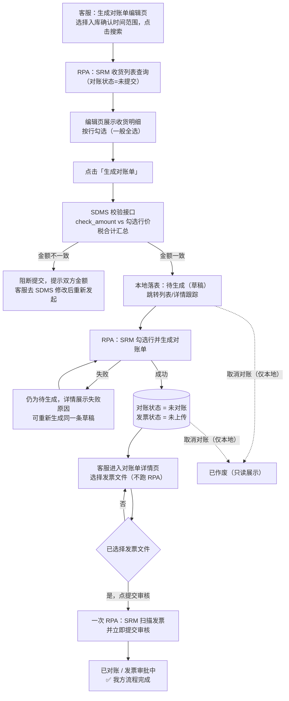
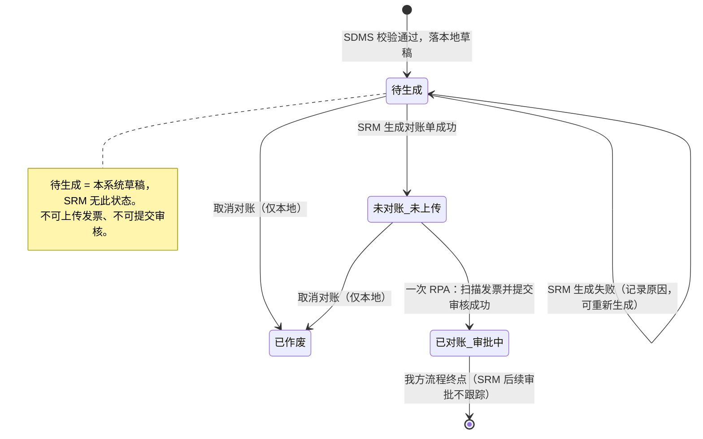

# AutoTask v3.0 业务需求：天地伟业对账单处理流程

> **文档状态（2026-08-18）**：**定稿 + 增量修订**。三轮 22 项确认仍有效；待生成草稿见 #23–#25。**#26–#28：扫描发票不能单独跑 RPA**，须与提交审核同一次完成。
>
> 前置流程：天地伟业客户订单自动化（v2.x）已开发完成，本文档为第二个流程场景——**客户对账单**。
>
> 前台 SOP 体验增量见 **[v3.01 天地伟业对账单 SOP](./AutoTask%20v3.01%20业务需求-天地伟业对账单SOP.md)**（列表/详情按阶段看步骤；本文业务规则仍有效）。

---

## 1. 背景与原始场景

### 1.1 原始场景（无 AutoTask 之前）

客服手工对账操作步骤：

1. 登录客户 SRM 系统，在「订单」页签 →「收货列表」中，按客户要求选择本次对账的具体月份（自然月），状态选「未提交」，查询出结果后导出（格式为 Excel）。具体请参考**附件 3：客户对账_电子表格版**（`project-docs/prd/收货信息_20260817141512.xlsx`，字段清单见附录 B）。
2. 与公司 SDMS 创建的客户对账单对比，确认双方本次对账的明细数据一致。
3. 在客户 SRM 系统点击「生成对账单」。
4. 在「对账」页签选中未对账行，点击「明细」，上传电子发票（需核对发票 Title、发票金额、发票总额、发票号是否一致），确认无误后提交审核。

### 1.2 本次场景设计目标

| 编号 | 功能 | 说明 |
|------|------|------|
| 功能一 | 生成对账单 | 拉取 SRM 收货明细 → SDMS 金额校验 → **立刻落本地草稿（待生成）** → RPA 在 SRM 生成对账单 → 成功后改为未对账 |
| 功能二 | 上传电子发票并提交审核 | 未对账对账单**直接读本地表**（不再定时扫 SRM）→ 客服选择发票文件（仅本机路径，不落库）→ 点「提交审核」后 **一次 RPA** 完成 SRM 扫描解析 + 提交审核 → 本侧流程完成 |

> **适用范围**：本流程只针对天地伟业客户，不按多客户通用模板设计。
>
> **跟踪范围**：只跟踪**本系统创建**的对账单；历史已在 SRM 生成的未对账/未上传对账单不在本期范围。
>
> **权限**：不做角色区分，当前仅客服与我方内部使用，按钮权限全部放开。

---

## 2. 核心设计决策（2026-08-17 确认）

| # | 决策 | 说明 |
|---|------|------|
| 1 | **生成即落本地表** | SDMS 校验通过后**立刻**写入本地对账单表，初始状态为「**待生成**」（本系统草稿，SRM 无此状态）；RPA 在 SRM 生成成功后再改为「未对账、未上传发票」。本地表是本流程的数据源 |
| 2 | **取消定时扫描** | 不再每 3 小时定时扫 SRM 未对账列表；「未对账对账单」列表直接读本地库 |
| 3 | **本地 ↔ SRM 匹配规则** | 本地对账单与 SRM 对账单通过 **对账日期 + 对账金额** 匹配（用于 RPA 在 SRM 对账列表中定位目标单据） |
| 4 | **流程边界** | 我方流程到「提交审核成功」为止（对账状态 = 已对账，发票状态 = 审批中）；**后续 SRM 审核通过/驳回等环节不属于客服操作，本期不管理** |
| 5 | **信任本地表** | 不做 SRM 状态回扫/同步；不考虑客服在 SRM 手工操作导致的两侧不一致 |

### 2.1 整体流程

```text
[功能一：生成对账单]
收货列表查询（SRM，对账状态=未提交 + 入库确认时间范围）
   → 用户按行勾选数据（一般全选），点击「生成对账单」
   → 调用 SDMS 校验接口（核对总对账金额，不一致则阻断）
   → 校验通过：本地立刻落表（对账状态 = **待生成** / 发票状态 = 未上传），并跳转列表/详情跟踪该草稿
   → RPA 在 SRM 勾选对应行并点击生成对账单
   → 成功：对账状态改为 **未对账**；失败：仍为待生成，详情展示失败原因，可重新生成

[功能二：选择发票并提交审核]
本地表读取「未对账」对账单列表
   → 用户进入详情，选择发票文件（Client 只记本机路径，不触发 RPA）
   → 点击「提交审核」（前置：已选文件）
   → **一次 RPA**：SRM 上传扫描 → 回读发票号/发票总额 → 立即提交审核
   → 本地状态：对账状态 = 已对账，发票状态 = 审批中
   → 我方流程完成（SRM 后续审核不跟踪）

> SRM 没有独立的「已上传未提交」落态。只扫描不提交时刷新页面仍为未对账/未上传，附件会消失。因此 **禁止** 单独跑上传发票 RPA。
```

### 2.2 流程图



### 2.3 状态机



---

## 3. 功能一：生成对账单

### 3.1 入口与页面

1. 在当前 Client「对账单流程实例」列表头部增加一个**「生成客户对账单」**按钮。
2. 点击按钮后进入**生成对账单编辑页面**：
   - 头部搜索条件：**入库确认时间**（用户选择开始、结束时间），点击「搜索」。
   - 搜索时 RPA 登录 SRM 系统 → 收货列表页，查询条件：对账状态 = 「未提交」+ 入库确认时间范围。
   - 收货明细结果展示到 Client 的生成对账单编辑页面。
3. 用户在页面上**按行勾选**需要的数据（一般全选；SRM 支持部分行生成对账单），点击「生成对账单」。

**页面列（与 SRM 收货列表导出字段一致，见附件 3 / 附录 B）：**

供应商编号、供应商名称、订单编号、收货单号、收货单行号、对账状态、单据类型、入库确认日期、料号、料品名称、料品规格、实收数量、单价（元）、未税单价（元）、税率、可立账未税金额（元）、可立账税额（元）、**可立账价税合计（元）**、单据日期、立账数量、实际到货日期。

- 行级唯一键：**收货单号 + 收货单行号**（RPA 在 SRM 页面勾选对应行时使用）。
- 勾选行的「可立账价税合计」汇总 = 本次预生成对账单金额，作为与 SDMS 核对的 SRM 侧金额。

### 3.2 SDMS 金额校验（生成前）

用户点击「生成对账单」后，**先调用 SDMS 校验接口**，只校验总对账金额，通过后才执行 SRM 生成。

**SDMS 内部对账单查询接口：**

| 项 | 内容 |
|------|------|
| URL | `http://api.qywx.smart-core.com.cn/sdms/ar_check/view_doc_srm` |
| 认证 | **无认证，直接调用** |
| 参数 `create_date_s` | 当前日期所在月开始日期，如 `2026-08-01 00:00:00` |
| 参数 `create_date_e` | 当前日期所在月结束日期，如 `2026-08-31 23:59:59` |
| 参数 `custom_son_code` | 固定值 `C007193-01_104`（天地伟业在 SDMS 的客户代码 + 业务主体编码，确定不变） |

> **查询口径**：我方只传「当前日期所在月」的起止时间，具体按哪个日期字段过滤由 SDMS 接口内部处理，我方不关心。返回字段已缩减为 `check_head_id` + `check_amount`，其他字段不使用。

**返回示例（裁剪关键字段，完整示例见附录 A）：**

```json
{
  "code": 1,
  "msg": "success",
  "data": [
    {
        "check_head_id": 36599,
        "check_amount": 20739830.66
    }
  ]
}
```

**异常约定：**

- 接口返回报错，或返回条数为 0，都算「没有找到 SDMS 对账单」，直接提示用户自行匹配（人工处理）。

**校验规则：**

| 校验项 | SDMS 侧 | Client 侧（本次勾选） |
|--------|---------|----------------------|
| 对账金额 | `check_amount` | 勾选行按行字段「可立账价税合计（元）」**本地汇总**（SRM 页面无合计显示，只能自行汇总） |

- 金额一致 → RPA 在 SRM 点击「生成对账单」。
- 金额不一致 → **阻断提交，提示双方具体金额（SDMS 金额 vs 勾选汇总金额），不允许容差、不允许强制生成**。客服收到提示后去 SDMS 修改对账单数据，再重新发起。

**失败处理：**

- SDMS 校验失败（找不到单或金额不一致）：**不落库**，留在生成页提示原因。
- 校验通过：立刻写入本地对账单，`check_status = DRAFT`（展示「待生成」），页面跳到该草稿的列表/详情，用户可跟踪生成任务。
- SRM 生成失败：草稿仍为「待生成」，详情记录失败原因；用户可在详情「重新生成」（更新同一条，不新建）。
- 待生成期间不能上传发票、不能提交审核。
- 同一租户下「对账日期 + 对账金额」已有待生成草稿时，再次生成复用该条。

### 3.3 本地落表（待生成草稿 → 未对账）

SDMS 校验通过后立刻写入本地对账单表：

| 字段 | 说明 |
|------|------|
| 对账日期 | 先记**当天**（SRM 生成成功后如有回写则按回写确认，一般即为当天），与 SRM 匹配的键之一 |
| 对账金额 | 勾选行的可立账价税合计汇总，与 SRM 匹配的键之一 |
| 对账状态 | 校验通过即 **待生成（DRAFT，本系统草稿，SRM 无此状态）**；SRM 生成成功后改为 **未对账** |
| 发票状态 | 初始 = **未上传** |
| 发票号 / 发票总额 | 初始为空，上传发票后从 SRM 页面读回（仅这两个字段，**不保存发票文件及其他发票信息**） |
| 客户 / Portal 账号 | 天地伟业（本期仅此客户） |

> **不落对账单表明细列**：收货列表查询结果不写入 `statement_bills`。勾选行快照在流程实例 `summary.lines`。生成页仍展示 **收货明细**（来源）；对账单详情页展示为 **对账明细**（v3.02）。也因此无需做「同月重复生成」的本地防护——SRM 侧行状态生成后即变化，重复搜索自然查不到已生成的行。

> **关于对账单号**：SRM 生成对账单后页面上无可用对账单号可回读，因此本地表不存对账单号；RPA 在 SRM 对账列表中定位单据只能靠「对账日期 + 对账金额」匹配。业务上一个月只生成一次对账单，同日期不会出现多张对账单，该匹配键够用。

---

## 4. 功能二：未对账对账单处理（上传发票 + 提交审核）

### 4.1 数据来源

- 「未对账对账单」列表**直接读本地对账单表**（状态 = 未对账），**不做定时扫描 SRM**。
- 本地对账单与 SRM 对账单的对应关系：通过 **对账日期 + 对账金额** 匹配，用于 RPA 在 SRM 中定位目标对账单。

### 4.2 选择发票（本机，不跑 RPA）

1. 用户从未对账列表进入对账单详情页。
2. 使用系统文件对话框选择发票（**仅记本机路径，不落库、不触发 RPA**）。
   - **限制：最多 10 个文件；格式 png / jpg / jpeg / pdf / ofd；单个文件不超过 20M**。
3. SRM **没有**独立的「已上传未提交」阶段。只扫描不提交时刷新页面仍为未对账/未上传，附件会消失。因此禁止单独发起「上传发票」RPA。

**对账单详情页展示字段（镜像 SRM 对账单页面，只读）：**

- 头表：对账日期、对账状态、发票状态、对账总额（元）、发票总额（元）、最后入库时间、对接业务员、发票号。
- 明细行：与收货列表导出字段一致（附录 B），**去掉「供应商编号、供应商名称」两列**——这两个是我方在 SRM 系统中的供应商 code 和公司名称，不属于对账单明细。即明细行展示：订单编号、收货单号、收货单行号、对账状态、单据类型、入库确认日期、料号、料品名称、料品规格、实收数量、单价（元）、未税单价（元）、税率、可立账未税金额（元）、可立账税额（元）、可立账价税合计（元）、单据日期、立账数量、实际到货日期。

### 4.3 提交审核（扫描 + 提交同一次 RPA）

1. 客服确认已选发票后点击「提交审核」。
2. **前置校验：至少选择一个发票文件**，否则不允许提交。发票号/发票总额由本次 RPA 在 SRM 扫描回写，提交前本地不必已有这两个字段。
3. **一次 RPA** 在同一浏览器会话内：定位对账单 → 扫描发票 → 回读发票号/发票总额（只读）→ 立即点提交审核。
4. 成功后本地写回发票号、发票总额，对账状态 = 已对账，发票状态 = 审批中。

**失败处理：**

- 不做自动重试，只记录操作失败原因并展示给用户。
- 失败时本地保持「未对账 / 未上传」；SRM 侧附件也不会保留。用户修正后重新选择文件再点「提交审核」。

### 4.4 状态流转（我方流程到此完成）

| 环节 | 对账状态 | 发票状态 |
|------|----------|----------|
| SDMS 校验通过落表 | **待生成**（本地草稿） | 未上传 |
| SRM 生成对账单成功 | 未对账 | 未上传 |
| 提交审核成功后（含扫描） | **已对账** | **审批中** |
| 取消对账后 | **已作废** | — |

> **流程边界**：提交审核成功即为我方流程终点。SRM 侧后续审批通过/驳回不属于客服操作范围，本期不跟踪、不回扫。

### 4.5 取消对账

- 未对账、待生成列表保留「取消对账」操作。
- **只更新本地状态（作废），RPA 不去 SRM 操作取消**；如需在 SRM 取消，由客服自行去 SRM 处理，不考虑两侧操作不一致的情况。
- 「已作废」含义：曾在我方创建过对账单、但不再需要。**只作展示，不能进一步操作**（保留在列表中，可筛选）。

---

## 5. 与 v2.x 架构的关系（建议）

- 对账单流程建议沿用 v2.x 的**流程模板 + `process_instances`** 机制，阶段划分建议：

| 阶段 | 显示文案 | 触发按钮 |
|------|----------|----------|
| `STMT_GENERATING` | 待生成（草稿） | 重新生成（失败时） |
| `STMT_PENDING_INVOICE` | 待上传发票 | **提交审核**（先选文件） |
| `STMT_PENDING_REVIEW` | 提交审核（历史遗留） | **提交审核**（须重新选文件；不再作为扫描成功后的等待态） |
| `SUBMITTED` | 已完成（已对账/审批中） | 查看证据 |
| `CANCELLED` | 已作废 | 无（只读展示） |

> 待生成是本系统草稿，SRM 无对应状态。SRM 生成失败不改状态，只记原因，详情可重新生成同一条。扫描+提交失败后停留未对账/未上传，用户重新选文件再点提交审核。

---

## 6. 需求确认记录

### 6.1 已确认事项（2026-08-17 需求方答复）

| # | 问题 | 答复 |
|---|------|------|
| 1 | 附件 3（SRM 收货列表导出字段清单） | 已提供：`project-docs/prd/收货信息_20260817141512.xlsx`，字段见附录 B |
| 2 | 选数粒度 | **按行勾选**，一般全选；SRM 支持部分行生成对账单 |
| 3 | SDMS 接口认证 | **无认证，直接调用** |
| 4 | `custom_son_code` 取值 | **固定值** `C007193-01_104`（天地伟业在 SDMS 的客户代码 + 业务主体编码，确定不变） |
| 5 | 金额不一致处理 | **阻断提交，提示具体金额，无容差**；客服去 SDMS 修改对账单数据后重新发起 |
| 6 | 对账单号与匹配键 | SRM 生成后页面无可回读的对账单号；匹配键「对账日期 + 对账金额」用于 RPA 在对账列表定位单据；一个月只生成一次，同日期不会有多张单 |
| 7 | 发票号/发票总额是否可编辑 | **只读**；扫描、识别、反写均为 SRM 功能，RPA 只配合操作 |
| 8 | 发票上传限制 | 最多 **10 个文件**，格式 png / jpg / jpeg / pdf / ofd，单个 ≤ **20M** |
| 9 | 取消对账 | 未对账列表保留该操作；**只更新本地状态，RPA 不去 SRM 取消**，客服自行在 SRM 处理 |
| 10 | 是否同步 SRM 状态 | **信任本地表**，不做同步，不考虑人为操作导致的不一致 |
| 11 | 通用性 | **只针对天地伟业**，其他客户基本用不了 |
| 12 | 对账日期口径 | **SRM 创建对账单的日期**（当天创建即为当天） |

### 6.2 已确认事项（第二轮，2026-08-17 需求方答复）

| # | 问题 | 答复 |
|---|------|------|
| 13 | 多发票上传的回写与存储 | 用户可一次选多张发票；扫描/识别/回写全是 SRM 功能，RPA 只执行上传并读页面回写字段；**本地不保存发票文件及其他发票信息**。SRM 对账单页面头表字段：对账日期、对账状态、发票状态、对账总额（元）、发票总额（元）、最后入库时间、对接业务员、发票号（其中发票总额、发票号为扫描回写）；明细行：单据类型、单据编号、行号、单据日期等 |
| 14 | SDMS 接口过滤口径与返回字段 | 返回字段已缩减为 `check_head_id` + `check_amount`，其他字段不使用；**我方只传当前日期所在月起止，过滤逻辑由 SDMS 接口内部处理** |
| 15 | 未对账列表业务键 | 无需额外业务键：未对账 + 对账日期重复基本不可能，再加总对账金额即可区分 |
| 16 | 「已作废」语义 | 曾在我方创建对账单但不再需要；**只作展示，不能进一步操作** |
| 17 | 失败重试策略 | **SDMS 校验失败不落库**；校验通过即落「待生成」草稿。SRM 生成失败停留待生成并展示原因，详情可重新生成同一条。上传/提交审核失败保持未对账/未上传，用户重新操作 |
| 18 | 校验金额来源 | **Client 本地勾选行汇总**（行字段「可立账价税合计（元）」）；SRM 页面无合计显示 |
| 19 | 对账单详情明细行字段 | 即收货列表导出字段（附录 B）**去掉「供应商编号、供应商名称」**——这两个是我方在 SRM 的供应商 code 和公司名称，不属于对账单明细 |
| 20 | 收货列表数据是否落本地 | **不落本地**，因此无需考虑同月重复生成的本地防护（SRM 行状态生成后即变化，天然防重） |
| 21 | 操作权限 | **放开**，不做角色区分（当前仅客服与我方内部使用） |
| 22 | 历史数据 | **不考虑**；只跟踪本系统创建的对账单，历史已生成的未对账/未上传对账单不在范围 |

### 6.3 已确认事项（2026-08-18）

| # | 问题 | 答复 |
|---|------|------|
| 23 | 生成后立刻离开页面，用户看不到 RPA 成败 | 调整设计：校验通过即创建**待生成**本地草稿，列表可见，详情跟踪任务 |
| 24 | 「待生成」与 SRM 状态关系 | **仅本系统状态，SRM 对账单没有**；语义 = 草稿。成功后才变为未对账 |
| 25 | 生成失败是否另增状态 | **否**。失败仍为待生成，详情记 `last_error`，可重新生成同一条 |
| 26 | 上传发票能否单独跑 RPA | **否**。SRM 刷新后未提交的附件会消失，扫描解析必须与提交审核在同一次 RPA 完成 |
| 27 | Client 何时触发 RPA | 选择发票不跑 RPA；客服点「提交审核」才发起 |
| 28 | 提交前是否必须已有发票号/金额 | **否**。这两个字段由本次 RPA 扫描回写；前置是已选发票文件 |

---

## 附录 A：SDMS 接口完整返回示例

```json
{
  "code": 1,
  "msg": "success",
  "data": [
    {
        "check_head_id": 36599,
        "check_amount": 20739830.66
    }
  ]
}
```

---

## 附录 B：附件 3 字段清单（SRM 收货列表导出）

来源文件：`project-docs/prd/收货信息_20260817141512.xlsx`（2026-08-17 导出，14 行数据）。

| # | 字段 | 样例值 | 备注 |
|---|------|--------|------|
| 1 | 供应商编号 | 02556 | |
| 2 | 供应商名称 | 深圳市芯云信息科技有限公司 | |
| 3 | 订单编号 | POJS2607130002 | 关联客户订单流程的业务键 |
| 4 | 收货单号 | WRJS2608140059 | 行级唯一键之一 |
| 5 | 收货单行号 | 10 | 行级唯一键之一 |
| 6 | 对账状态 | 未对账 | 查询条件：未提交 |
| 7 | 单据类型 | 标准收货[默认] | |
| 8 | 入库确认日期 | 2026-08-14 | 导出 Excel 中为日期序列值，页面展示为日期 |
| 9 | 料号 | 1B.30040.020260 | |
| 10 | 料品名称 | 芯片-视频编解码 | |
| 11 | 料品规格 | [SSC375]-(C)-QFN88(9x9mm)-sigmastar | |
| 12 | 实收数量 | 18720 | |
| 13 | 单价（元） | 36.8496 | |
| 14 | 未税单价（元） | 32.610265 | |
| 15 | 税率 | 0.13 | |
| 16 | 可立账未税金额（元） | 610464.17 | |
| 17 | 可立账税额（元） | 79360.34 | |
| 18 | **可立账价税合计（元）** | 689824.51 | 金额校验的 SRM 侧汇总字段 |
| 19 | 单据日期 | 2026-08-14 | |
| 20 | 立账数量 | 18720 | |
| 21 | 实际到货日期 | 2026-08-14 | |
