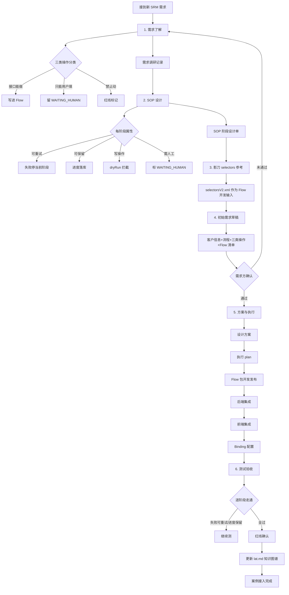
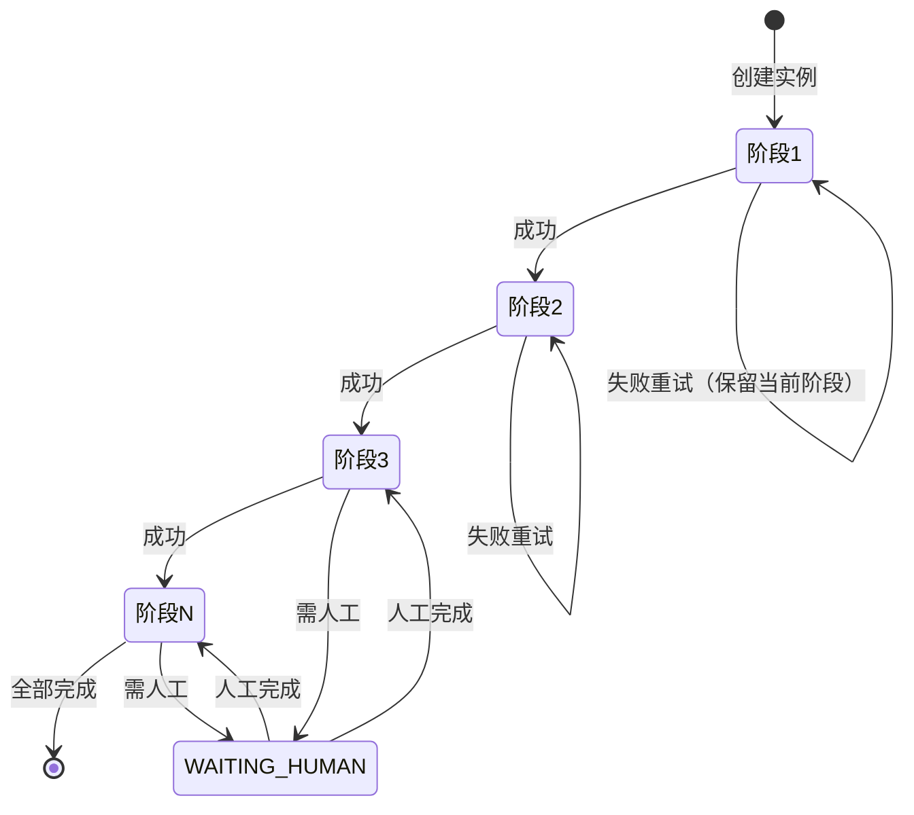

# AutoTask 新案例接入 SOP

| 项 | 内容 |
| --- | --- |
| 版本 | v1.0 |
| 适用 | 接到第三个、第四个 SRM 客户需求的开发 |
| 目的 | 告诉开发"接到需求后按什么顺序做什么、每步产出什么文档"，不展开功能实现 |
| 参考 | 已完成两个案例：天地伟业（[prd/tiandy/](./prd/tiandy/)）、京东方 BOE（[prd/boe/](./prd/boe/)，仅 Flow 开发，集成未做） |

案例接入本质：**不是配置驱动，是按流程逐阶段落地**。每个阶段可重试、可保留当前阶段进度，失败不回滚整单。

---

## 0. 全流程总表

```text
1. 需求了解 → 2. SOP 设计 → 3. 影刀 selectors 参考 → 4. 初始需求草稿 → 5. 方案 plan 执行 → 6. 测试验收
```

### 0.1 整体流程图



### 0.2 SOP 阶段运行模型



### 0.3 阶段-产出对照表

| 阶段 | 开发做什么 | 产出文档 |
| --- | --- | --- |
| 1. 需求了解 | 摸清 SRM 具体操作，区分接口能做的和只能用户填的，标出哪些操作禁止动 | 需求调研记录 |
| 2. SOP 设计 | 按客户业务拆成阶段，每阶段可重试、可保留当前阶段 | SOP 阶段设计单 |
| 3. 影刀 selectors 参考 | 把 `selectorsV2.xml` 作为 Flow 开发的重要参考输入 | （无独立文档，作为 Flow 开发依据） |
| 4. 初始需求草稿 | 整理本案例的初始需求草稿 | 初始需求草稿 |
| 5. 方案与执行 | 出设计方案和 plan，按 plan 逐步写任务代码 | 设计方案、执行 plan |
| 6. 测试验收 | 按 SOP 节点走通，确认红线 | 验收单 |

---

## 1. 需求了解

**开发做什么**：

1. 跟需求方对齐客户门户 URL、登录账号、业务主体名
2. 摸清客户 SRM 的具体操作流程：哪个页面、点哪个按钮、填哪个字段、出什么结果
3. 区分三类操作：
   - **接口能做**：可以由 RPA/接口自动完成的（写进 Flow）
   - **只能用户填**：必须人工判断或手填的（留 WAITING_HUMAN，开嵌入式浏览让客服操作）
   - **禁止动**：红线不允许自动化的写操作（演练期不点，上线期等授权）
4. 把三类操作在调研记录里列清楚

**产出文档**：`需求调研记录`（客户信息 + SRM 操作流程 + 三类操作分类表）

---

## 2. SOP 设计

**开发做什么**：

1. 按客户业务把流程拆成有序阶段（例：扫单 → 建单 → 填交期 → 签章 → 回签 → 下载合同）
2. 每个阶段的设计原则：
   - **可重试**：失败不回滚整单，停在当前阶段，可单独再跑
   - **可保留当前阶段**：进度落库，崩溃重启后从当前阶段继续
   - 每阶段对应一个或多个 Flow 子任务
3. 标出哪些阶段是纯查询（不写对方 SRM）、哪些是写操作（需 dryRun 拦截）
4. 标出哪些阶段必须人工介入（验证码、MFA、业务判断）

**产出文档**：`SOP 阶段设计单`（阶段顺序表 + 每阶段可重试/保留/dryRun/人工 标记）

---

## 3. 影刀 selectors 参考

**开发做什么**：

1. 拿到客户提供的影刀录制产物 `selectorsV2.xml`（参考 [prd/tiandy/selectorsV2.xml](./prd/tiandy/selectorsV2.xml)、[prd/boe/影刀-京东方-selectorsV2.xml](./prd/boe/影刀-京东方-selectorsV2.xml)）
2. 把它作为 Flow 开发的重要参考输入：
   - 页面元素的定位路径、稳定 selector
   - 操作顺序、点击/填值/等待节奏
   - 弹窗、翻页、勾选等边界动作
3. 翻译成 Playwright Flow 时优先复用影刀验证过的 selector，避免凭经验重写导致脆弱
4. 影刀能做但 Playwright 不能直接做的（如某些桌面操作），转人工或换实现

**产出文档**：无独立文档，作为 Flow 开发的输入依据

---

## 4. 整理初始需求草稿

**开发做什么**：

1. 把前三步的结论汇总成一份初始需求草稿（参考 [prd/boe/AutoTask-BOE初始草稿业务需求整理.md](./prd/boe/AutoTask-BOE初始草稿业务需求整理.md) 的写法）
2. 草稿包含：
   - 客户基本信息
   - SRM 业务流程概述
   - 阶段划分与每阶段的可重试/保留/人工属性
   - 接口能做 vs 用户必填 vs 禁止动 的清单
   - 影刀 selectors 来源说明
   - 预计要开发的 Flow 清单
3. 草稿交给需求方确认后再进入方案阶段

**产出文档**：`初始需求草稿`（一份完整可确认的需求文档）

---

## 5. 需求设计方案、plan、执行写任务代码

**开发做什么**：

1. 基于初始需求草稿出 `设计方案`：案例接入的策略、技术选型、阶段与 Flow 的映射、风险点
2. 基于设计方案出 `执行 plan`：拆成可跟踪的任务项，每项有责任人/产出/依赖
3. 按 plan 逐项写代码：
   - Flow 包开发与发布
   - 后端集成（按 SOP 阶段定义、timer、迁移等）
   - 前端集成（菜单、流程模型、UI）
   - Binding 配置
4. 每完成一项在 plan 上打勾，记录遇到的问题和决策

**产出文档**：
- `设计方案`（策略 + 阶段 Flow 映射 + 风险）
- `执行 plan`（任务清单 + 进度跟踪）
- 代码本身（无独立文档）

---

## 6. 测试验收

**开发做什么**：

1. 按 SOP 阶段逐个走通：
   - 演练门户跑完整流程，dryRun 不真写对方 SRM
   - 每阶段失败后能重试，进度能保留
   - 人工介入点能正确进 WAITING_HUMAN
2. 确认红线：
   - 正式站定时器停用
   - `.env.product` 不覆盖测库
   - 未授权不执行迁移
   - 演练门户不绑正式包，正式门户不绑演示包
3. 验收通过后更新 lat.md 知识图谱，补本案例的架构决策和 Flow 清单

**产出文档**：`案例验收单`（逐阶段打勾 + 红线确认 + 知识图谱更新记录）

---

## 7. 常见红线

1. 不能把测库 `.env` 覆盖到正式库 `.env.product`
2. Flow 不能自启 browser、连 CDP、直连业务库（违反沙箱契约）
3. 未口头授权不能建表、不能执行迁移、不能 upgrade head
4. 正式库不能 upgrade 到 v3 测库 head
5. 正式站未停用定时器就演练，会写真实 SRM
6. 演练门户不能绑正式 Flow 包，正式门户不能绑演示包
7. 写操作必须幂等；结果不明确时转人工，不盲目重试
