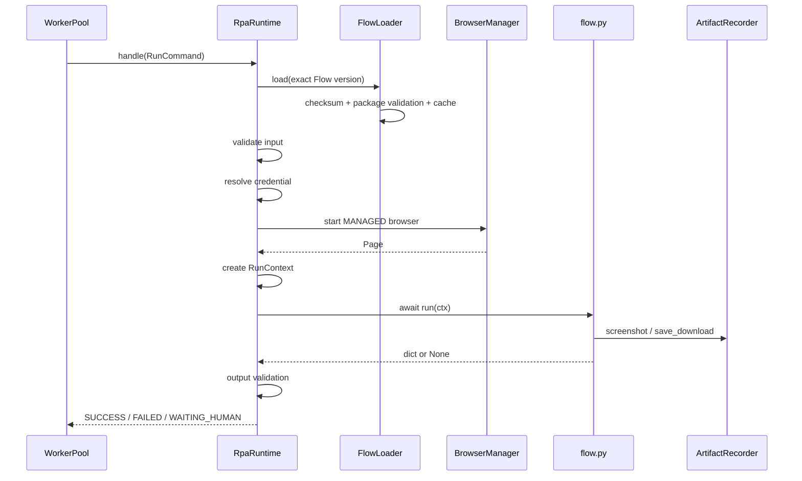

# 一、总体结论

`copilot-rpa` 的 `v0.1` 分支并不是传统的桌面录制型 RPA，也不是可视化流程编排器。它本质上是一个：

> **面向 AutoTask / NoDeskClaw 的服务端 RPA 执行引擎，采用 Flow-as-Code、版本化 Flow Registry、Worker Lease 调度和托管 Playwright 浏览器运行时。**

仓库分支名是 `v0.1`，但当前 Python 包版本已经是 `0.6.0`。技术栈为 Python 3.12、FastAPI、SQLAlchemy Async、PostgreSQL、S3/MinIO、Playwright、HTTPX、Pydantic Settings。

它的产品边界很明确：

* `copilot-rpa` 管理 Flow、Flow Package、Worker、执行尝试、浏览器 Runtime、Artifact 和回调投递。
* `nodeskclaw-task` 管理 WorkflowBinding、业务任务、Run、HumanAction、业务事件和 Artifact 元数据。
* Task 决定“执行什么”；Engine 决定“如何安全、确定性地执行”。

---

# 二、项目框架

## 2.1 总体架构

```mermaid
flowchart LR
    Portal[管理端 / 发布工具] --> RegistryAPI[Flow Registry API]
    RegistryAPI --> PG[(PostgreSQL<br/>rpa_engine schema)]
    RegistryAPI --> S3[(MinIO / S3<br/>Flow Packages)]

    Task[nodeskclaw-task] -->|register / heartbeat / lease| WorkerPool
    WorkerPool --> Resolver[FlowVersionResolver]
    Resolver --> PG
    WorkerPool --> Runtime[RpaRuntime]

    Runtime --> Loader[FlowLoader]
    Loader --> S3
    Loader --> Cache[Local Flow Cache]

    Runtime --> Browser[Managed Playwright Browser]
    Runtime --> Context[RunContext]
    Context --> Flow[flow.py:run(ctx)]

    Flow --> Artifact[ArtifactRecorder]
    Artifact --> Task

    Flow --> Events[Runtime Events]
    Runtime --> Result[RunResult]
    Events --> Outbox[(Callback Outbox)]
    Result --> Outbox
    Outbox --> Task
```

FastAPI 应用启动时按配置装配数据库、对象存储、Task Client、Flow Registry、Runtime、Worker Pool 和 Callback Outbox。各组件支持构造函数注入，测试时可以替换真实外部依赖，整体属于较清晰的模块化单体。

## 2.2 目录职责

根据源码依赖关系，核心目录可以归纳为：

```text
src/nodeskclaw_rpa_engine/
├── api/
│   ├── app.py                 FastAPI 装配、生命周期、异常映射
│   └── routes/                health、flows、workers
├── core/
│   ├── config.py              环境配置与启动约束
│   ├── health.py              readiness / liveness
│   └── logging.py             结构化日志和脱敏
├── db/
│   ├── session.py             Async SQLAlchemy
│   └── models/
│       ├── flow.py            Flow、Version、Validation、Audit
│       ├── execution.py       Worker、Attempt、Callback Outbox
│       └── browser.py         Browser Profile、CDP Endpoint 预留
├── flows/
│   ├── manifest.py            Flow Manifest 协议
│   ├── package.py             ZIP、AST、安全策略校验
│   ├── service.py             Registry 生命周期
│   └── repository.py          Registry 数据访问
├── workers/
│   ├── pool.py                Worker 状态、并发、调度、续租
│   ├── source.py              Lease 命令源
│   ├── resolver.py            精确版本解析
│   ├── task_client.py         Task Worker API Client
│   └── outbox.py              EVENT / FINISH 可靠投递
├── runtime/
│   ├── engine.py              RPA 执行主循环
│   ├── loader.py              Flow 下载、缓存、动态加载
│   ├── browser.py             Playwright 浏览器生命周期
│   ├── context.py             Flow 能力注入
│   ├── artifacts.py           截图、下载、Trace
│   └── errors.py              错误分类与终态映射
├── mock_srm/                  本地确定性 Portal
└── main.py                    应用入口
```

数据库基线共包含九个 Engine 所有的模型：Flow、Flow Version、Validation Run、Release Audit、Worker Instance、Execution Attempt、Callback Outbox、Browser Profile、CDP Endpoint。

---

# 三、RPA 引擎逻辑

## 3.1 Worker 生命周期

Worker 的执行入口不是一个公开的 `/run-flow` HTTP API，而是 Task Lease。

```text
Engine 启动
  → Worker register
  → 本地 Worker 状态写入 ONLINE
  → 恢复中断的 LEASED / RUNNING Attempt
  → heartbeat loop
  → lease polling loop
  → 按本地并发槽位接收任务
```

核心状态包括：

```text
Worker:
ONLINE → BUSY → ONLINE
ONLINE → DRAINING → OFFLINE

Attempt:
LEASED → RUNNING
        → SUCCESS
        → FAILED
        → WAITING_HUMAN
        → CANCELLED
        → ABANDONED
```

Worker 会限制并发槽位、避免重复 `leaseId`、创建执行 Attempt、续租 Lease，并在 Worker 重启时把残留执行恢复为 `ABANDONED`。

## 3.2 任务获取与续租

`LeaseRunCommandSource` 根据 Worker 的能力和剩余槽位向 Task 请求 Lease：

```python
WorkerLeaseRequest(
    worker_id=...,
    capabilities=[...],
    limit=available_slots,
)
```

执行期间按照固定周期续租。如果续租失败，Runtime 不会立即停止，而是允许任务运行到当前已知的 `leaseExpiresAt`；到期后结果转为 `ABANDONED / LEASE_EXPIRED`。

Lease 是一次执行的不可变快照，包含：

```text
taskId
runId
leaseId
workflowBindingId
portalAccountId
tenantId

workflowTemplateId
workflowCode

rpaFlowId
rpaFlowVersion
rpaEngineType

credentialRef
input

config.portalUrl
config.browserSession

leaseExpiresAt
```

这意味着流程执行不需要在运行中再次读取 WorkflowBinding，降低了配置漂移。

## 3.3 Flow 精确解析

Engine 不使用 `latest`、默认版本或模糊匹配。

```text
lease.rpaFlowId
+ lease.rpaFlowVersion
+ lease.tenantId
        ↓
FlowVersionResolver
        ↓
必须找到 ACTIVE Flow + PUBLISHED Version
        ↓
返回 packageObjectKey + checksum + capabilities
```

找不到精确版本、版本不是已发布状态、包元数据不完整，任务都会在执行前被拒绝。

这是项目最重要的设计之一：**WorkflowBinding 和运行快照都固定到不可变 Flow Version，而不是依赖运行时自动寻找最新版本。**

## 3.4 RpaRuntime 主循环

Runtime 的执行顺序如下：



Runtime 负责：

* 工作目录检测。
* 下载并校验 Flow Package。
* Manifest 输入校验。
* 凭据解析。
* 浏览器创建。
* RunContext 注入。
* 超时控制。
* 整个 Flow 的重试。
* 错误分类。
* 失败截图和 Trace。
* 输出 JSON 校验。
* 浏览器清理和工作目录清理。

## 3.5 浏览器运行时

当前只支持：

```text
mode = MANAGED
channel = chromium | chrome | msedge
closePolicy = ALWAYS | CLOSE_ON_FINISH
profileRef = null
cdpEndpointRef = null
```

每次 Run 都会：

```text
async_playwright.start()
→ chromium.launch()
→ browser.new_context()
→ context.tracing.start()
→ context.new_page()
→ 执行流程
→ context.close()
→ browser.close()
→ playwright.stop()
```

因此，虽然协议中的 `engineType` 名称为 `PLAYWRIGHT_CDP`，当前实现实际上是：

> **Playwright Managed Browser Engine，而不是外部 CDP Browser Attachment Engine。**

它既不连接已有 Chrome 会话，也不恢复持久化 Profile。

## 3.6 错误处理

流程可以抛出四类领域异常：

| 异常                      | 结果                     |
| ----------------------- | ---------------------- |
| `RpaRetryableError`     | 重试，耗尽后 `FAILED`        |
| `RpaBusinessError`      | `FAILED`               |
| `RpaHumanRequiredError` | `WAITING_HUMAN`        |
| `RpaFatalError`         | `FAILED`               |
| 未识别异常                   | `FLOW_UNHANDLED_ERROR` |

Playwright 异常和超时也被归入可重试错误。

当前 `WAITING_HUMAN` 是 Type-A 模式：

```text
采集截图和 Trace
→ 关闭当前浏览器
→ Run 进入 WAITING_HUMAN
→ 人工在外部完成处理
```

它不会保留或恢复原浏览器上下文。

---

# 四、流程注入机制

该项目中的“流程注入”分为三层，而不是简单加载一个 Python 文件。

## 4.1 第一层：Flow Package 注入

Flow 以 ZIP Package 形式进入 Registry：

```text
flow-package.zip
├── manifest.json
├── flow.py
└── selectors.json        可选
```

Manifest 定义：

```json
{
  "rpaFlowId": "rpa_flow_mock_srm_fetch_po",
  "version": "1.1.0",
  "engineType": "PLAYWRIGHT_CDP",
  "entrypoint": "flow.py:run",
  "supportedWorkflowCodes": ["srm_fetch_po"],
  "inputSchema": [],
  "capabilities": [],
  "minimumEngineVersion": "0.5.0"
}
```

上传阶段执行：

1. ZIP 大小、文件数、解压体积和压缩比检查。
2. 拒绝路径穿越、绝对路径、反斜杠路径和符号链接。
3. 拒绝 `.env`、`credentials.json`、`secrets.json`。
4. 校验 Manifest。
5. AST 校验顶层 `async def run(ctx)`。
6. 执行 Runtime Policy 静态检查。
7. 计算 SHA-256。
8. 上传到 S3/MinIO。
9. 创建 DRAFT Flow Version。
10. 记录 Validation 和 Release Audit。

Flow Package 对象键固定为：

```text
flows/{rpaFlowId}/{version}/{sha256}.zip
```

同一版本不能覆盖。Registry 状态机为：

```text
DRAFT → VALIDATING → PUBLISHED → DEPRECATED
                     ↓              ↓
                   DISABLED ←───────┘
```

构建工具通过固定 ZIP 时间戳和文件顺序保证相同源码产生相同校验和，已发布版本校验和发生变化时拒绝重新构建。

## 4.2 第二层：执行快照注入

Task 通过 Lease 注入本次运行参数：

```text
Flow ID 和精确版本
Workflow Code
业务输入
Portal Account
Portal URL
Credential Reference
Browser Session 配置
Tenant
Lease 到期时间
```

Worker 会校验：

* Engine Type 是否匹配。
* Workflow Code 是否受 Flow 支持。
* Worker 是否具备 Flow 要求的全部 Capability。
* Flow 是否 ACTIVE。
* 版本是否 PUBLISHED。
* Browser Session 是否符合 MANAGED 契约。
* Lease 是否未过期。

## 4.3 第三层：RunContext 能力注入

Runtime 不把数据库、对象存储、Task Client 或 Browser Manager 暴露给 Flow，而是生成：

```python
RunContext(
    input=...,
    credentials=...,
    page=...,
    portal_url=...,
    selectors=...,
    artifacts=...,
    log=...,
    events=...,
    config=...,
)
```

Flow 的稳定接口是：

```python
async def run(ctx):
    await ctx.page.goto(ctx.portal_url)
    await ctx.page.fill(...)
    await ctx.artifacts.screenshot(...)
    await ctx.events.emit(...)
    await ctx.log.info(...)
```

这相当于一个轻量级的 Flow SDK。基础设施能力由 Engine 注入，业务流程只负责步骤逻辑。

## 4.4 第四层：动态加载

`FlowLoader` 会：

```text
从对象存储下载 ZIP
→ 验证 Registry checksum
→ 再次执行 Package Validator
→ 校验 Manifest 与 Registry 身份一致
→ 原子解压到本地缓存
→ 根据 flow.py 创建唯一 Python module
→ exec_module()
→ 获取 async run 函数
```

缓存路径为：

```text
runtime-cache/flows/
  {rpaFlowId}/
    {version}/
      {checksum}/
```

---

# 五、项目的主要优点

## 5.1 Flow 与业务任务解耦

Flow Registry 不拥有业务任务，Task 不拥有 Flow Package。两者通过精确版本的 WorkflowBinding 和 Lease 快照连接。这比把脚本直接存入任务表更容易治理。

## 5.2 不可变版本设计正确

`Flow ID + Version + Checksum` 三重固定，且运行时不允许回退到 latest。对企业 RPA 审计、问题复现和版本回滚非常重要。

## 5.3 基础设施与业务流程分离

Flow 不需要自行实现：

* 浏览器创建和清理。
* 下载目录。
* Trace。
* Artifact 上传。
* Task 回调。
* 重试。
* 错误映射。
* 凭据获取。

示例 `1.1.0` 的 Flow 只保留登录、查询订单、打开详情和下载文件等业务步骤。

## 5.4 执行状态较完整

已经覆盖 Worker heartbeat、并发槽位、Attempt、Lease renewal、重启恢复、drain、终态和 Outbox，不再是一个简单的 Playwright Runner。

## 5.5 回调可靠性基础已经建立

EVENT 和 FINISH 使用持久化 Outbox：

* `PENDING / IN_FLIGHT / RETRY / SENT / DEAD`
* `SELECT ... FOR UPDATE SKIP LOCKED`
* 指数退避
* 稳定 `Idempotency-Key`
* 同一 Attempt 内顺序投递
* 进程异常后的 stale lock 恢复

---

# 六、关键问题与风险

## 6.1 P0：Flow 不是安全沙箱

这是当前最大风险。

Package Validator 只禁止了少量 import 和调用：

```text
asyncpg
playwright
psycopg
sqlalchemy

open
launch
connect_over_cdp
...
```

但没有禁止：

```text
os
subprocess
socket
httpx
requests
ctypes
importlib
__import__
pathlib
shutil
sys
```

Flow 随后通过 `spec.loader.exec_module(module)` 在 Engine 进程内直接执行，而且模块顶层代码会在 `run(ctx)` 之前执行。

因此，当前 AST 检查只能防止误用，不能防止恶意或失控代码。理论上一个 Flow 可以：

* 读取 Engine 环境变量。
* 启动子进程。
* 访问本地文件。
* 发起任意网络请求。
* 阻塞动态加载线程。
* 修改进程级全局状态。
* 导致整个 Worker 进程崩溃。

文档也明确承认当前没有 OS 级隔离。

**建议：**

```text
Engine 主进程
  → Flow Runner 子进程
      → 独立用户
      → CPU / 内存 / 时间限制
      → 独立工作目录
      → 网络出口策略
      → JSON-RPC / gRPC RunContext Proxy
```

生产环境至少应做到进程隔离，进一步可使用容器或轻量沙箱。

## 6.2 P0：`ctx.page` 暴露过宽

虽然 Flow 不允许自行 import Playwright，但它拿到的是完整的 `Page` 对象。

Flow 可以通过 Page 间接访问 BrowserContext，执行任意 JavaScript、创建新的页面或改变浏览器状态。当前 Capability 不是严格的能力边界，只是运行前标签校验。

更稳妥的方式是注入受控的 `BrowserApi`：

```python
ctx.browser.goto()
ctx.browser.click()
ctx.browser.fill()
ctx.browser.download()
ctx.browser.screenshot()
```

而不是直接暴露原生 Playwright Page。

## 6.3 P0：Portal URL 缺少网络出口治理

`portalUrl` 只检查：

* 必须是 HTTP/HTTPS。
* 必须有 host。
* URL 中不能包含用户名密码。

没有域名白名单、IP 范围限制或 SSRF 防护。

受控 Flow 可以借助浏览器访问：

* 内部管理系统。
* 本机服务。
* 云元数据地址。
* 未授权的租户 Portal。

应由 `portalAccountId` 在 Engine 或独立 Portal Config Service 中解析允许域名，Lease 不应直接决定任意 URL。

## 6.4 P0：真实 Task 闭环尚未验收

当前 README 和阶段文档明确说明：

* `WORKER_LEASE_ENABLED=false` 是默认值。
* 已完成的是 Task OpenAPI Schema 只读检查。
* 尚未完成真实 lease、renew、event、Artifact、finish 全链路。
* `TASK_AUTH_MODE=none` 仍是测试兼容模式。
* 生产 Service Account 鉴权未完成。

因此，当前更准确的成熟度是：

> Registry、Runtime 和本地确定性 Flow 已基本形成，但中央 Task 驱动的生产闭环仍处于联调前阶段。

## 6.5 P1：整个 Flow 重试可能重复业务副作用

Runtime 的重试粒度是整个 `run(ctx)`：

```text
登录
→ 查询
→ 提交业务操作
→ 下载失败
→ 整个 Flow 重新执行
```

如果前半部分已经产生外部业务副作用，重试可能重复提交。项目文档已经明确指出这个问题。

后续应引入：

```text
stepId
stepAttempt
idempotencyKey
checkpoint
retryPolicy
compensationPolicy
```

不一定要改造成静态 DAG，但应把步骤语义从日志字段升级为正式执行模型。

## 6.6 P1：HumanAction 只能终止，不能续跑

当前 `WAITING_HUMAN` 会关闭服务器浏览器。它适合“人工另行处理”，不适合：

* CAPTCHA 人工输入后继续。
* 手机验证码。
* 人工确认弹窗。
* 业务审批后恢复原页面。
* 登录态较难重建的长流程。

建议明确支持两种模式：

```text
TYPE_A_TERMINAL
证据采集后关闭浏览器，等待新的 Task。

TYPE_B_RESUMABLE
保存 checkpoint + storage_state + 页面恢复信息，
HumanAction 完成后创建新的受控续跑 Attempt。
```

不建议长时间保留原 Browser Process，而应通过恢复点重新建立浏览器状态。

## 6.7 P1：Artifact 交付没有进入 Outbox

EVENT 和 FINISH 已经持久化，但 Artifact 链路仍是直接调用：

```text
申请上传 URL
→ PUT 对象
→ 创建 Artifact metadata
```

任一步失败会抛出 `RpaRetryableError`，可能触发整个 Flow 重试。

建议增加：

```text
rpa_artifact_delivery
PENDING_UPLOAD
UPLOADED
METADATA_PENDING
COMPLETED
FAILED
```

避免因为 Artifact 元数据写入失败而重新执行具有业务副作用的 Flow。

## 6.8 P1：所谓不可变 RunContext 只是浅层不可变

当前实现是：

```python
MappingProxyType(copy.deepcopy(dict(value)))
```

顶层 Mapping 不可赋值，但内部嵌套 dict/list 仍可被修改。

如果执行快照必须不可变，应递归冻结，或使用严格 Pydantic Model / dataclass DTO。

## 6.9 P1：输入协议过于简单

Manifest 的输入定义只支持：

```text
name
type
required
description
```

Runtime 也只检查顶层基本类型。没有：

* enum
* pattern
* min/max
* nested object schema
* array item schema
* additionalProperties
* format
* 默认值
* 敏感字段标记

建议直接采用 JSON Schema 子集作为 `inputSchema` 和 `outputSchema`。

## 6.10 P2：命名与版本容易产生认知混乱

当前同时存在：

```text
仓库：copilot-rpa
应用：NoDeskClaw RPA Engine
业务：AutoTask
分支：v0.1
Python 包版本：0.6.0
engineType：PLAYWRIGHT_CDP
实际模式：MANAGED Playwright
```

建议统一形成：

```text
产品：Work Copilot RPA Engine
协议版本：workcopilot.rpa.v1
Engine Release：0.6.0
Flow Package Spec：rpa.flow.v1
Runtime Type：PLAYWRIGHT_MANAGED
```

---

# 七、最终定位判断

当前 `copilot-rpa v0.1` 已经具备一个企业 RPA Runtime 的主要骨架：

```text
Flow Registry
+ 不可变版本
+ Flow Package
+ Worker Lease
+ Execution Attempt
+ Managed Browser
+ Runtime Context
+ Artifact
+ Event / Finish Outbox
```

它最适合的场景是：

> **由开发人员创建和审核 Flow，通过 Registry 发布版本，由 AutoTask 根据业务 WorkflowBinding 调度服务端浏览器执行。**

它暂时不适合直接定位为：

* 面向业务人员的低代码 RPA。
* 桌面操作录制器。
* 可视化 BPMN/DAG 引擎。
* 安全运行第三方 Flow 的多租户沙箱。
* 可长期挂起并恢复浏览器会话的 Human-in-the-Loop 引擎。

综合判断：

| 维度             |  当前成熟度 |
| -------------- | -----: |
| 项目分层           |   8/10 |
| Flow 版本治理      | 8.5/10 |
| Runtime 完整性    | 7.5/10 |
| Worker 可靠性     |   7/10 |
| Task 真实联调      |   4/10 |
| Flow 安全隔离      |   2/10 |
| HumanAction 恢复 |   3/10 |
| 生产可用性          |   5/10 |

最优先的下一阶段不是增加更多业务 Flow，而是完成三项基础能力：

1. **Flow Runner 进程或容器隔离。**
2. **Task Lease、续租、Artifact、Outbox、Finish 的真实端到端验收。**
3. **凭据服务、Portal 域名策略与生产 Service Account 鉴权。**
